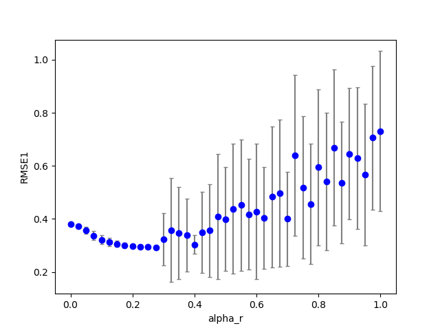
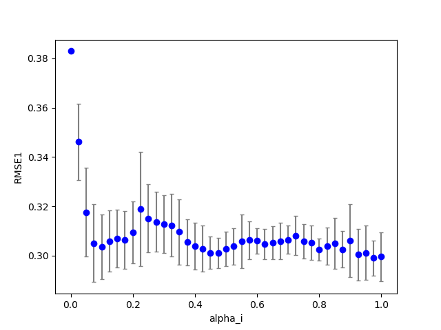
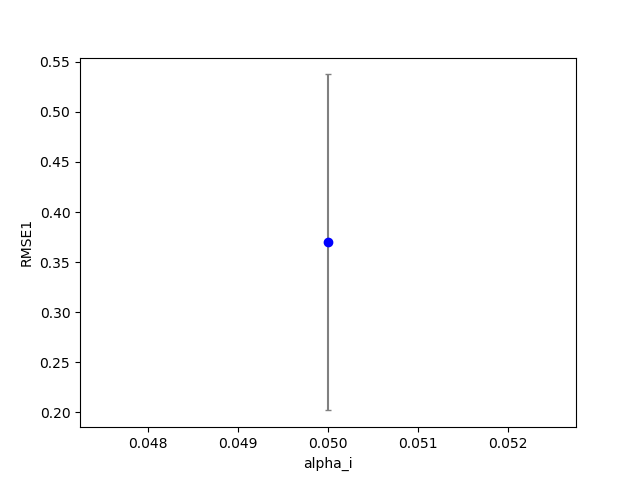

## cbmrc6b2 
### Optimization 
Start:2018/12/10 08:40:42  
## cbmrc6b2 
### Optimization 
Start:2018/12/10 08:43:15  
Done :2018/12/10 19:21:08  
Result:  
```
dataset : 3.000000
seed    : 9.500000
NN      :200.000000
Nh      :100.000000
alpha_i : 0.050000
alpha_r : 0.110000
alpha_b : 0.000000
alpha_s : 1.930000
alpha0  : 0.000000
alpha1  : 0.000000
beta_i  : 0.100000
beta_r  : 0.100000
beta_b  : 0.100000
Temp    : 1.000000
lambda0 : 0.100000
RMSE1   : 0.317658
RMSE2   : 0.000000
count_gap: 0.000000
TARGET  : 0.317658
```
### Grid search (grid_s1d) 
***1D grid search on alpha_r (min=0 max=1 num=41 samples=20)***  
base command: `python cbmrc6b2.py display=0 dataset=3 alpha_r=0.110000 alpha_i=0.050000 alpha_s=1.930000 `  
Data:**data20181210b_cbmrc6b2_ds3_grid_s1d_alpha_r.csv**  
Start:2018/12/10 19:21:09  
Done :2018/12/10 21:33:52  
Figure:** data20181210b_cbmrc6b2_ds3_grid_s1d_alpha_r.png **  
  
### Grid search (grid_s1d) 
***1D grid search on alpha_i (min=0 max=1 num=41 samples=20)***  
base command: `python cbmrc6b2.py display=0 dataset=3 alpha_r=0.110000 alpha_i=0.050000 alpha_s=1.930000 `  
Data:**data20181210b_cbmrc6b2_ds3_grid_s1d_alpha_i.csv**  
Start:2018/12/10 21:33:53  
Done :2018/12/10 23:45:17  
Figure:** data20181210b_cbmrc6b2_ds3_grid_s1d_alpha_i.png **  
  
### Grid search (grid_s1d) 
***1D grid search on alpha_s (min=0 max=1 num=41 samples=20)***  
base command: `python cbmrc6b2.py display=0 dataset=3 alpha_r=0.110000 alpha_i=0.050000 alpha_s=1.930000 `  
Data:**data20181210b_cbmrc6b2_ds3_grid_s1d_alpha_s.csv**  
Start:2018/12/10 23:45:18  
Done :2018/12/11 01:55:55  
Figure:** data20181210b_cbmrc6b2_ds3_grid_s1d_alpha_s.png **  
  
