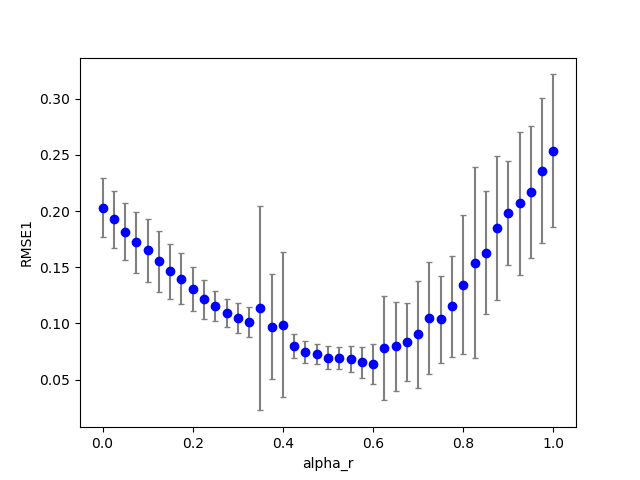
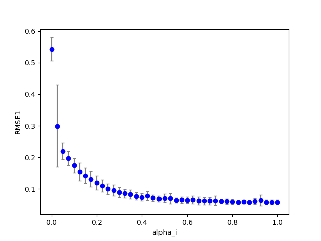

## cbmrc6c2 (dataset:2)
### Optimization 
Start:2018/12/11 01:05:50  
Done :2018/12/11 04:14:06  
Result:  
```
dataset : 2.000000
seed    : 9.500000
NN      :200.000000
Nh      :100.000000
alpha_i : 0.460000
alpha_r : 0.500000
alpha_b : 0.000000
alpha_s : 1.340000
alpha0  : 0.000000
alpha1  : 0.000000
beta_i  : 0.100000
beta_r  : 0.100000
beta_b  : 0.100000
Temp    : 1.000000
lambda0 : 0.100000
RMSE1   : 0.069554
RMSE2   : 0.000000
count_gap: 0.050000
TARGET  : 0.074554
```
### Grid search (grid_s1d) 
***1D grid search on alpha_r (min=0 max=1 num=41 samples=20)***  
base command: `python cbmrc6c2.py display=0 dataset=2 alpha_r=0.500000 alpha_i=0.460000 alpha_s=1.340000 `  
Data:**data20181210b_cbmrc6c2_ds2_grid_s1d_alpha_r.csv**  
Start:2018/12/11 04:14:06  
Done :2018/12/11 04:52:34  
Figure:** data20181210b_cbmrc6c2_ds2_grid_s1d_alpha_r.png **  
  
### Grid search (grid_s1d) 
***1D grid search on alpha_i (min=0 max=1 num=41 samples=20)***  
base command: `python cbmrc6c2.py display=0 dataset=2 alpha_r=0.500000 alpha_i=0.460000 alpha_s=1.340000 `  
Data:**data20181210b_cbmrc6c2_ds2_grid_s1d_alpha_i.csv**  
Start:2018/12/11 04:52:35  
Done :2018/12/11 05:31:15  
Figure:** data20181210b_cbmrc6c2_ds2_grid_s1d_alpha_i.png **  
  
### Grid search (grid_s1d) 
***1D grid search on alpha_s (min=0 max=1 num=41 samples=20)***  
base command: `python cbmrc6c2.py display=0 dataset=2 alpha_r=0.500000 alpha_i=0.460000 alpha_s=1.340000 `  
Data:**data20181210b_cbmrc6c2_ds2_grid_s1d_alpha_s.csv**  
Start:2018/12/11 05:31:16  
Done :2018/12/11 06:09:10  
Figure:** data20181210b_cbmrc6c2_ds2_grid_s1d_alpha_s.png **  
  
