## esn1 (dataset:2)
### Optimization
Start:2018/12/10 15:02:53  
Done :2018/12/10 15:03:53  
Result:  
```
dataset : 2.000000
seed    : 4.500000
Nx      :100.000000
alpha_i : 1.030000
alpha_r : 0.820000
alpha_b : 0.800000
alpha0  : 0.700000
tau     : 0.820000
beta_i  : 0.100000
beta_r  : 0.100000
beta_b  : 0.100000
lambda0 : 0.100000
RMSE1   : 0.005580
RMSE2   : 0.000000
TARGET  : 0.005580
```
## esn1 (dataset:2)
### Grid search (grid_s1d)
***1D grid search on alpha_r (min=0 max=1 num=41 samples=20)***  
base command: `python esn1.py display=0 dataset=2 alpha_r=0.82 alpha_i=1.03 alpha0=0.7 tau=0.82 `  
Data:**data20181210b_esn1_grid_s1d_alpha_r.csv**  
Start:2018/12/10 15:16:16  
Done :2018/12/10 15:17:09  
Figure:** data20181210b_esn1_grid_s1d_alpha_r.png **  
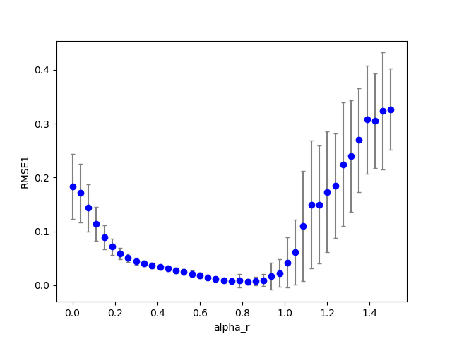  
### Grid search (grid_s1d)
***1D grid search on alpha_i (min=0 max=2 num=41 samples=20)***  
base command: `python esn1.py display=0 dataset=2 alpha_r=0.82 alpha_i=1.03 alpha0=0.7 tau=0.82 `  
Data:**data20181210b_esn1_grid_s1d_alpha_i.csv**  
Start:2018/12/10 15:17:09  
Done :2018/12/10 15:18:02  
Figure:** data20181210b_esn1_grid_s1d_alpha_i.png **  
  
### Grid search (grid_s1d)
***1D grid search on alpha_0 (min=0 max=1 num=41 samples=20)***  
base command: `python esn1.py display=0 dataset=2 alpha_r=0.82 alpha_i=1.03 alpha0=0.7 tau=0.82 `  
Data:**data20181210b_esn1_grid_s1d_alpha0.csv**  
Start:2018/12/10 15:18:02  
Done :2018/12/10 15:18:55  
Figure:** data20181210b_esn1_grid_s1d_alpha0.png **  
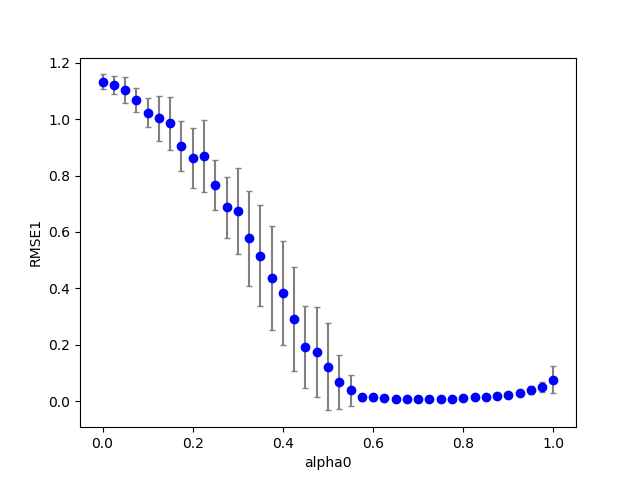  
### Grid search (grid_s1d)
***1D grid search on tau (min=0 max=2 num=41 samples=20)***  
base command: `python esn1.py display=0 dataset=2 alpha_r=0.82 alpha_i=1.03 alpha0=0.7 tau=0.82 `  
Data:**data20181210b_esn1_grid_s1d_tau.csv**  
Start:2018/12/10 15:18:55  
Done :2018/12/10 15:19:48  
Figure:** data20181210b_esn1_grid_s1d_tau.png **  
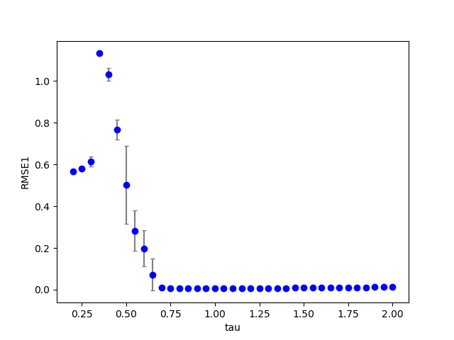  
## esn1 (dataset:2)
### Grid search (grid_s1d)
***1D grid search on alpha0 (min=0 max=1 num=41 samples=20)***  
base command: `python esn1.py display=0 dataset=2 alpha_r=0.82 alpha_i=1.03 alpha0=0.7 tau=0.82 `  
Data:**data20181210b_esn1_grid_s1d_alpha0.csv**  
Start:2018/12/10 15:22:05  
Done :2018/12/10 15:22:57  
Figure:** data20181210b_esn1_grid_s1d_alpha0.png **  
  
## esn1 (dataset:3)
### Optimization
Start:2018/12/10 15:28:03  
Done :2018/12/10 15:29:19  
Result:  
```
dataset : 3.000000
seed    : 4.500000
Nx      :100.000000
alpha_i : 0.010000
alpha_r : 0.940000
alpha_b : 0.800000
alpha0  : 0.960000
tau     : 1.210000
beta_i  : 0.100000
beta_r  : 0.100000
beta_b  : 0.100000
lambda0 : 0.100000
RMSE1   : 0.269948
RMSE2   : 0.000000
TARGET  : 0.269948
```
### Grid search (grid_s1d)
***1D grid search on alpha_r (min=0 max=1 num=41 samples=20)***  
base command: `python esn1.py display=0 dataset=3 alpha_r=0.940000 alpha_i=0.010000 alpha0=0.980000 tau=1.190000 `  
Data:**data20181210b_esn1_dataset3_grid_s1d_alpha_r.csv**  
Start:2018/12/10 15:29:19  
Done :2018/12/10 15:30:23  
Figure:** data20181210b_esn1_dataset3_grid_s1d_alpha_r.png **  
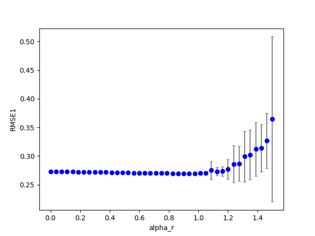  
### Grid search (grid_s1d)
***1D grid search on alpha_i (min=0 max=2 num=41 samples=20)***  
base command: `python esn1.py display=0 dataset=3 alpha_r=0.940000 alpha_i=0.010000 alpha0=0.980000 tau=1.190000 `  
Data:**data20181210b_esn1_dataset3_grid_s1d_alpha_i.csv**  
Start:2018/12/10 15:30:23  
Done :2018/12/10 15:31:29  
Figure:** data20181210b_esn1_dataset3_grid_s1d_alpha_i.png **  
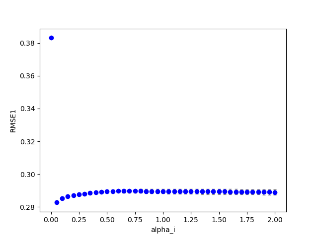  
### Grid search (grid_s1d)
***1D grid search on alpha0 (min=0 max=1 num=41 samples=20)***  
base command: `python esn1.py display=0 dataset=3 alpha_r=0.940000 alpha_i=0.010000 alpha0=0.980000 tau=1.190000 `  
Data:**data20181210b_esn1_dataset3_grid_s1d_alpha0.csv**  
Start:2018/12/10 15:31:29  
Done :2018/12/10 15:32:34  
Figure:** data20181210b_esn1_dataset3_grid_s1d_alpha0.png **  
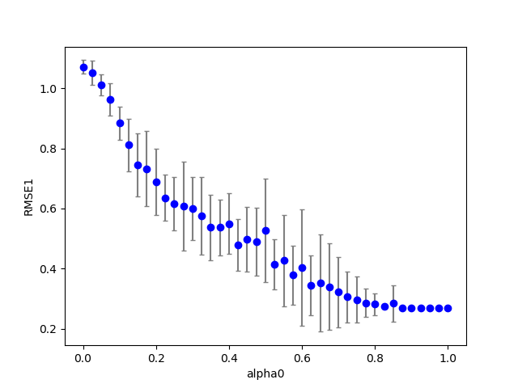  
### Grid search (grid_s1d)
***1D grid search on tau (min=0 max=2 num=41 samples=20)***  
base command: `python esn1.py display=0 dataset=3 alpha_r=0.940000 alpha_i=0.010000 alpha0=0.980000 tau=1.190000 `  
Data:**data20181210b_esn1_dataset3_grid_s1d_tau.csv**  
Start:2018/12/10 15:32:34  
Done :2018/12/10 15:33:39  
Figure:** data20181210b_esn1_dataset3_grid_s1d_tau.png **  
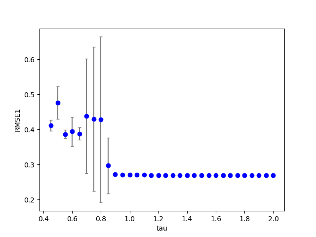  
## esn1 (dataset:1)
### Optimization
Start:2018/12/10 15:39:08  
Done :2018/12/10 15:40:10  
Result:  
```
dataset : 1.000000
seed    : 4.500000
Nx      :100.000000
alpha_i : 0.950000
alpha_r : 0.770000
alpha_b : 0.800000
alpha0  : 0.600000
tau     : 2.000000
beta_i  : 0.100000
beta_r  : 0.100000
beta_b  : 0.100000
lambda0 : 0.100000
RMSE1   : 0.329011
RMSE2   : 0.000000
TARGET  : 0.329011
```
### Grid search (grid_s1d)
***1D grid search on alpha_r (min=0 max=1 num=41 samples=20)***  
base command: `python esn1.py display=0 dataset=1 alpha_r=0.770000 alpha_i=0.950000 alpha0=0.600000 tau=2.000000 `  
Data:**data20181210b_esn1_dataset1_grid_s1d_alpha_r.csv**  
Start:2018/12/10 15:40:10  
Done :2018/12/10 15:41:02  
Figure:** data20181210b_esn1_dataset1_grid_s1d_alpha_r.png **  
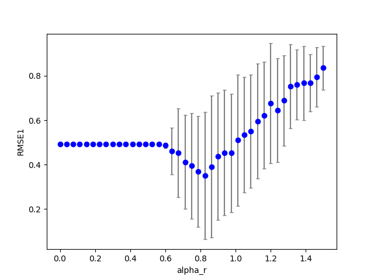  
### Grid search (grid_s1d)
***1D grid search on alpha_i (min=0 max=2 num=41 samples=20)***  
base command: `python esn1.py display=0 dataset=1 alpha_r=0.770000 alpha_i=0.950000 alpha0=0.600000 tau=2.000000 `  
Data:**data20181210b_esn1_dataset1_grid_s1d_alpha_i.csv**  
Start:2018/12/10 15:41:02  
Done :2018/12/10 15:41:55  
Figure:** data20181210b_esn1_dataset1_grid_s1d_alpha_i.png **  
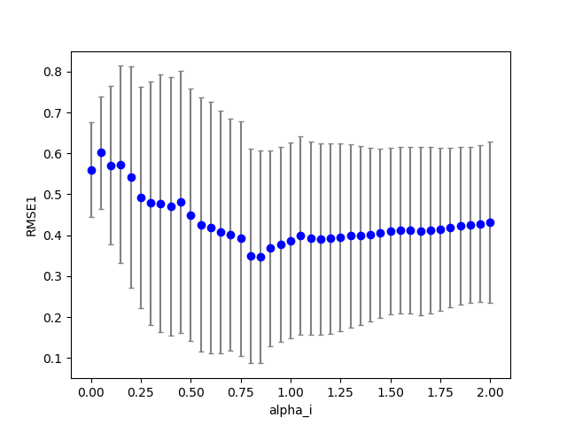  
### Grid search (grid_s1d)
***1D grid search on alpha0 (min=0 max=1 num=41 samples=20)***  
base command: `python esn1.py display=0 dataset=1 alpha_r=0.770000 alpha_i=0.950000 alpha0=0.600000 tau=2.000000 `  
Data:**data20181210b_esn1_dataset1_grid_s1d_alpha0.csv**  
Start:2018/12/10 15:41:55  
Done :2018/12/10 15:42:48  
Figure:** data20181210b_esn1_dataset1_grid_s1d_alpha0.png **  
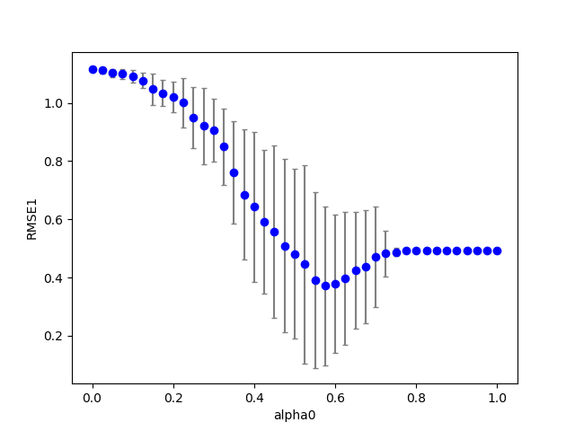  
### Grid search (grid_s1d)
***1D grid search on tau (min=0 max=2 num=41 samples=20)***  
base command: `python esn1.py display=0 dataset=1 alpha_r=0.770000 alpha_i=0.950000 alpha0=0.600000 tau=2.000000 `  
Data:**data20181210b_esn1_dataset1_grid_s1d_tau.csv**  
Start:2018/12/10 15:42:48  
Done :2018/12/10 15:43:39  
Figure:** data20181210b_esn1_dataset1_grid_s1d_tau.png **  
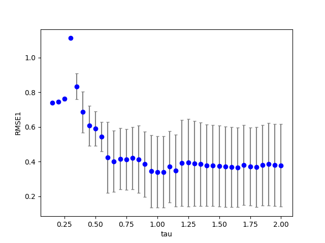  
## esn1 (dataset:1)
### Grid search (grid_s1d)
***1D grid search on tau (min=0 max=5 num=41 samples=20)***  
base command: `python esn1.py display=0 dataset=1 alpha_r=0.77 alpha_i=0.95 alpha0=0.60 tau=2.0`  
Data:**data20181210b_esn1_dataset1_grid_s1d2_tau.csv**  
Start:2018/12/10 17:31:34  
Done :2018/12/10 17:32:26  
Figure:** data20181210b_esn1_dataset1_grid_s1d2_tau.png **  
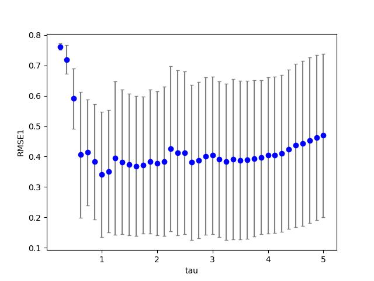  

### 考察
単純sinカーブが複合の場合よりもエラーが多きい。
