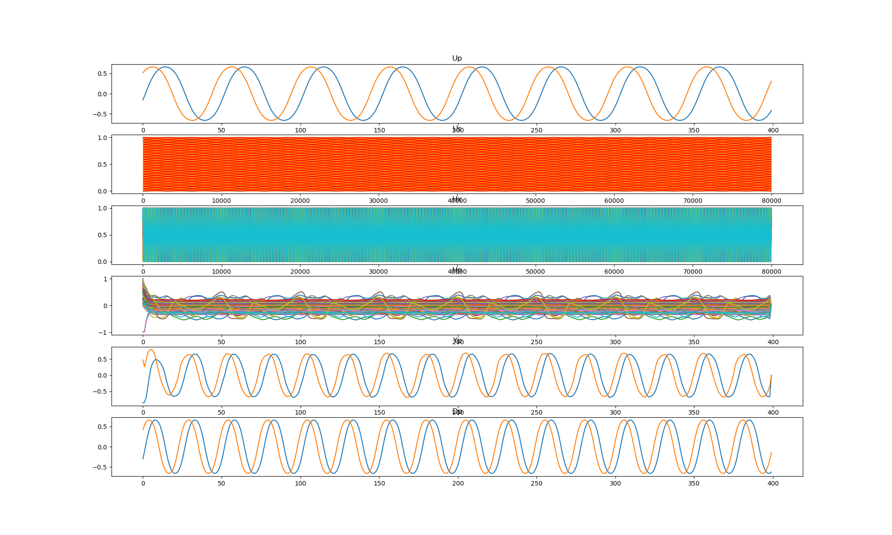
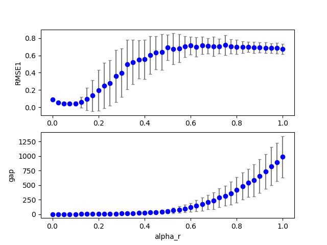
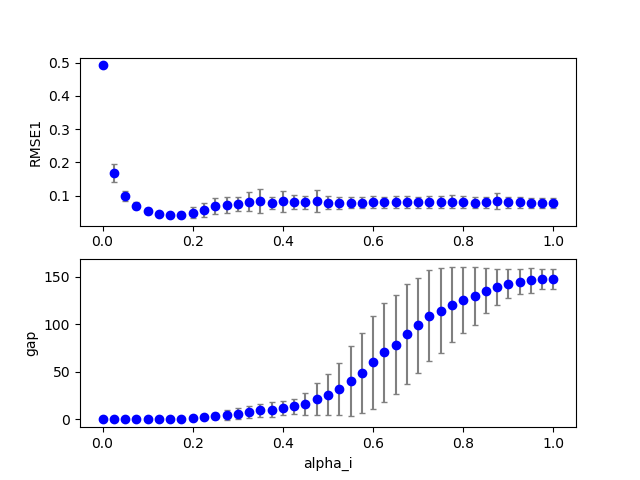
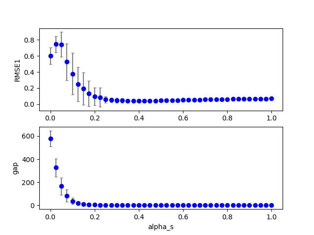

## cbmrc6b3 (dataset:1)  
### Optimization 
Configuration:  
```
id      : 0.000000
seed    : 0.000000
alpha_r : 0.200000
alpha_i : 0.200000
alpha_s : 0.200000
TARGET: <function func at 0x7f6d48fd2e18> 
iteration: 10 
population: 20 
samples: 20 
```
Start:2018/12/17 21:49:53  
Done :2018/12/18 01:36:16  
Result:  
```
dataset : 1.000000
seed    : 9.500000
NN      :200.000000
Nh      :100.000000
alpha_i : 0.180000
alpha_r : 0.060000
alpha_b : 0.000000
alpha_s : 0.380000
alpha0  : 0.000000
alpha1  : 0.000000
beta_i  : 0.100000
beta_r  : 0.100000
beta_b  : 0.100000
Temp    : 1.000000
lambda0 : 0.100000
RMSE1   : 0.039031
RMSE2   : 0.000000
count_gap: 0.000000
TARGET  : 0.039031
```
Figure:** data20181217_cbmrc6b3_test.png **  
  
### Grid search (scan1ds) 
1D grid search on *** alpha_r (min=0.000000 max=1.000000 num=41 samples=20) ***  
Base configuration: `python cbmrc6b3.py display=0 dataset=1 alpha_r=0.060000 alpha_i=0.180000 alpha_s=0.380000 `  
Data:**data20181217_cbmrc6b3_scan1ds_alpha_r.csv**  
Start:2018/12/18 01:36:44  
Done :2018/12/18 02:23:05  
Figure:** data20181217_cbmrc6b3_scan1ds_alpha_r.png **  
  
### Grid search (scan1ds) 
1D grid search on *** alpha_i (min=0.000000 max=1.000000 num=41 samples=20) ***  
Base configuration: `python cbmrc6b3.py display=0 dataset=1 alpha_r=0.060000 alpha_i=0.180000 alpha_s=0.380000 `  
Data:**data20181217_cbmrc6b3_scan1ds_alpha_i.csv**  
Start:2018/12/18 02:23:06  
Done :2018/12/18 03:08:39  
Figure:** data20181217_cbmrc6b3_scan1ds_alpha_i.png **  
  
### Grid search (scan1ds) 
1D grid search on *** alpha_s (min=0.000000 max=1.000000 num=41 samples=20) ***  
Base configuration: `python cbmrc6b3.py display=0 dataset=1 alpha_r=0.060000 alpha_i=0.180000 alpha_s=0.380000 `  
Data:**data20181217_cbmrc6b3_scan1ds_alpha_s.csv**  
Start:2018/12/18 03:08:40  
Done :2018/12/18 03:54:17  
Figure:** data20181217_cbmrc6b3_scan1ds_alpha_s.png **  
  
## cbmrc6b3 (dataset:1)  
### Optimization 
Configuration:  
```
id      : 0.000000
seed    : 0.000000
alpha_r : 0.200000
alpha_i : 0.200000
alpha_s : 0.200000
TARGET: <function func at 0x7f8796f71e18> 
iteration: 10 
population: 20 
samples: 20 
```
Start:2018/12/18 03:54:19  
Done :2018/12/18 07:40:38  
Result:  
```
dataset : 1.000000
seed    : 9.500000
NN      :200.000000
Nh      :100.000000
alpha_i : 0.120000
alpha_r : 0.060000
alpha_b : 0.000000
alpha_s : 0.290000
alpha0  : 0.000000
alpha1  : 0.000000
beta_i  : 0.100000
beta_r  : 0.100000
beta_b  : 0.100000
Temp    : 1.000000
lambda0 : 0.100000
RMSE1   : 0.040321
RMSE2   : 0.000000
count_gap: 0.000000
TARGET  : 0.040321
```
Figure:** data20181217_cbmrc6b3_test.png **  
  
### Grid search (scan1ds) 
1D grid search on *** alpha_r (min=0.000000 max=1.000000 num=41 samples=20) ***  
Base configuration: `python cbmrc6b3.py display=0 dataset=1 alpha_r=0.060000 alpha_i=0.120000 alpha_s=0.290000 `  
Data:**data20181217_cbmrc6b3_scan1ds_alpha_r.csv**  
Start:2018/12/18 07:41:07  
Done :2018/12/18 08:27:58  
Figure:** data20181217_cbmrc6b3_scan1ds_alpha_r.png **  
  
### Grid search (scan1ds) 
1D grid search on *** alpha_i (min=0.000000 max=1.000000 num=41 samples=20) ***  
Base configuration: `python cbmrc6b3.py display=0 dataset=1 alpha_r=0.060000 alpha_i=0.120000 alpha_s=0.290000 `  
Data:**data20181217_cbmrc6b3_scan1ds_alpha_i.csv**  
Start:2018/12/18 08:27:58  
Done :2018/12/18 09:14:13  
Figure:** data20181217_cbmrc6b3_scan1ds_alpha_i.png **  
  
### Grid search (scan1ds) 
1D grid search on *** alpha_s (min=0.000000 max=1.000000 num=41 samples=20) ***  
Base configuration: `python cbmrc6b3.py display=0 dataset=1 alpha_r=0.060000 alpha_i=0.120000 alpha_s=0.290000 `  
Data:**data20181217_cbmrc6b3_scan1ds_alpha_s.csv**  
Start:2018/12/18 09:14:14  
Done :2018/12/18 10:00:30  
Figure:** data20181217_cbmrc6b3_scan1ds_alpha_s.png **  
  
## cbmrc6b3 (dataset:1)  
### Optimization 
Configuration:  
```
id      : 0.000000
seed    : 0.000000
alpha_r : 0.200000
alpha_i : 0.200000
alpha_s : 0.200000
TARGET: <function func at 0x7faec9fa9e18> 
iteration: 10 
population: 20 
samples: 20 
```
Start:2018/12/18 10:00:32  
Done :2018/12/18 13:46:12  
Result:  
```
dataset : 1.000000
seed    : 9.500000
NN      :200.000000
Nh      :100.000000
alpha_i : 0.200000
alpha_r : 0.100000
alpha_b : 0.000000
alpha_s : 0.500000
alpha0  : 0.000000
alpha1  : 0.000000
beta_i  : 0.100000
beta_r  : 0.100000
beta_b  : 0.100000
Temp    : 1.000000
lambda0 : 0.100000
RMSE1   : 0.036420
RMSE2   : 0.000000
count_gap: 0.000000
TARGET  : 0.036420
```
Figure:** data20181217_cbmrc6b3_test.png **  
  
### Grid search (scan1ds) 
1D grid search on *** alpha_r (min=0.000000 max=1.000000 num=41 samples=20) ***  
Base configuration: `python cbmrc6b3.py display=0 dataset=1 alpha_r=0.100000 alpha_i=0.200000 alpha_s=0.500000 `  
Data:**data20181217_cbmrc6b3_scan1ds_alpha_r.csv**  
Start:2018/12/18 13:46:41  
Done :2018/12/18 14:33:32  
Figure:** data20181217_cbmrc6b3_scan1ds_alpha_r.png **  
  
### Grid search (scan1ds) 
1D grid search on *** alpha_i (min=0.000000 max=1.000000 num=41 samples=20) ***  
Base configuration: `python cbmrc6b3.py display=0 dataset=1 alpha_r=0.100000 alpha_i=0.200000 alpha_s=0.500000 `  
Data:**data20181217_cbmrc6b3_scan1ds_alpha_i.csv**  
Start:2018/12/18 14:33:32  
Done :2018/12/18 15:19:45  
Figure:** data20181217_cbmrc6b3_scan1ds_alpha_i.png **  
  
### Grid search (scan1ds) 
1D grid search on *** alpha_s (min=0.000000 max=1.000000 num=41 samples=20) ***  
Base configuration: `python cbmrc6b3.py display=0 dataset=1 alpha_r=0.100000 alpha_i=0.200000 alpha_s=0.500000 `  
Data:**data20181217_cbmrc6b3_scan1ds_alpha_s.csv**  
Start:2018/12/18 15:19:46  
Done :2018/12/18 16:05:54  
Figure:** data20181217_cbmrc6b3_scan1ds_alpha_s.png **  
  
