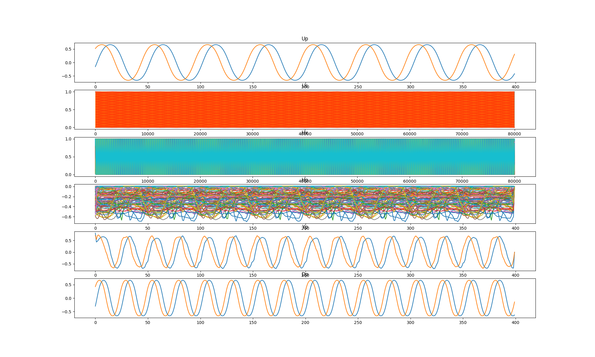
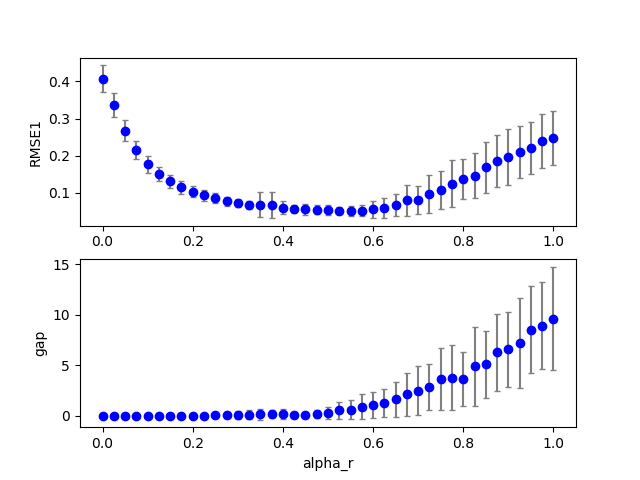
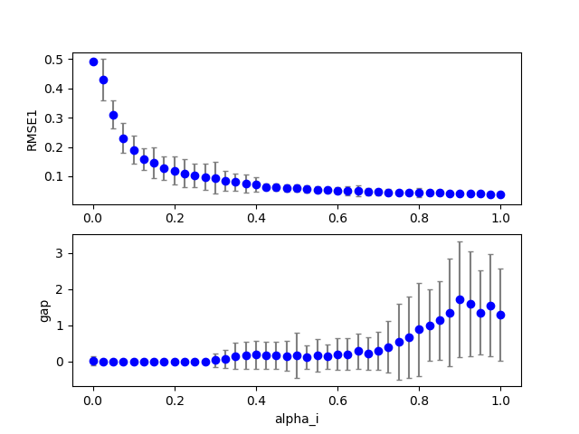
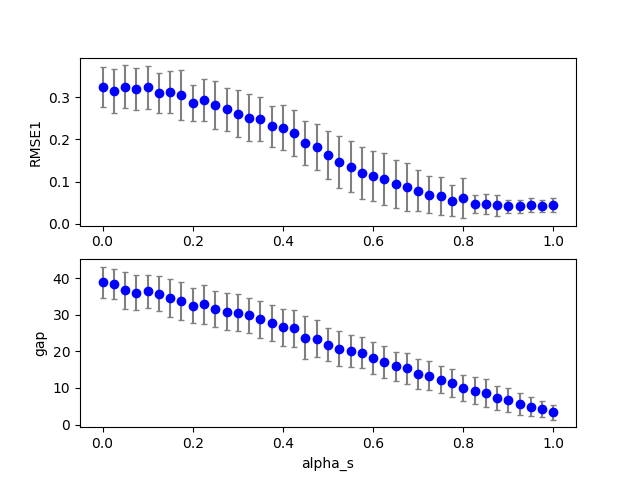

## cbmrc6c3 (dataset:1)  
### Optimization 
Configuration:  
```
id      : 0.000000
seed    : 0.000000
alpha_r : 0.200000
alpha_i : 0.200000
alpha_s : 0.200000
TARGET: <function func at 0x7f5cab930c80> 
iteration: 10 
population: 20 
samples: 20 
```
Start:2018/12/17 21:31:27  
Done :2018/12/18 01:06:38  
Result:  
```
dataset : 1.000000
seed    : 9.500000
NN      :200.000000
Nh      :100.000000
alpha_i : 0.520000
alpha_r : 0.420000
alpha_b : 0.000000
alpha_s : 1.290000
alpha0  : 0.000000
alpha1  : 0.000000
beta_i  : 0.100000
beta_r  : 0.100000
beta_b  : 0.100000
Temp    : 1.000000
lambda0 : 0.100000
RMSE1   : 0.056102
RMSE2   : 0.000000
count_gap: 0.050000
TARGET  : 0.061102
```
Figure:** data20181217_cbmrc6c3_test.png **  
  
### Grid search (scan1ds) 
1D grid search on *** alpha_r (min=0.000000 max=1.000000 num=41 samples=20) ***  
Base configuration: `python cbmrc6c3.py display=0 dataset=1 alpha_r=0.430000 alpha_i=0.520000 alpha_s=1.280000 `  
Data:**data20181217_cbmrc6c3_scan1ds_alpha_r.csv**  
Start:2018/12/18 01:07:07  
Done :2018/12/18 01:51:18  
Figure:** data20181217_cbmrc6c3_scan1ds_alpha_r.png **  
  
### Grid search (scan1ds) 
1D grid search on *** alpha_i (min=0.000000 max=1.000000 num=41 samples=20) ***  
Base configuration: `python cbmrc6c3.py display=0 dataset=1 alpha_r=0.430000 alpha_i=0.520000 alpha_s=1.280000 `  
Data:**data20181217_cbmrc6c3_scan1ds_alpha_i.csv**  
Start:2018/12/18 01:51:19  
Done :2018/12/18 02:35:28  
Figure:** data20181217_cbmrc6c3_scan1ds_alpha_i.png **  
  
### Grid search (scan1ds) 
1D grid search on *** alpha_s (min=0.000000 max=1.000000 num=41 samples=20) ***  
Base configuration: `python cbmrc6c3.py display=0 dataset=1 alpha_r=0.430000 alpha_i=0.520000 alpha_s=1.280000 `  
Data:**data20181217_cbmrc6c3_scan1ds_alpha_s.csv**  
Start:2018/12/18 02:35:29  
Done :2018/12/18 03:19:02  
Figure:** data20181217_cbmrc6c3_scan1ds_alpha_s.png **  
  
## cbmrc6c3 (dataset:1)  
### Optimization 
Configuration:  
```
id      : 0.000000
seed    : 0.000000
alpha_r : 0.200000
alpha_i : 0.200000
alpha_s : 0.200000
TARGET: <function func at 0x7f9d6b34cc80> 
iteration: 10 
population: 20 
samples: 20 
```
Start:2018/12/18 03:19:04  
Done :2018/12/18 06:54:40  
Result:  
```
dataset : 1.000000
seed    : 9.500000
NN      :200.000000
Nh      :100.000000
alpha_i : 0.600000
alpha_r : 0.420000
alpha_b : 0.000000
alpha_s : 1.320000
alpha0  : 0.000000
alpha1  : 0.000000
beta_i  : 0.100000
beta_r  : 0.100000
beta_b  : 0.100000
Temp    : 1.000000
lambda0 : 0.100000
RMSE1   : 0.051208
RMSE2   : 0.000000
count_gap: 0.100000
TARGET  : 0.061208
```
Figure:** data20181217_cbmrc6c3_test.png **  
  
### Grid search (scan1ds) 
1D grid search on *** alpha_r (min=0.000000 max=1.000000 num=41 samples=20) ***  
Base configuration: `python cbmrc6c3.py display=0 dataset=1 alpha_r=0.420000 alpha_i=0.600000 alpha_s=1.320000 `  
Data:**data20181217_cbmrc6c3_scan1ds_alpha_r.csv**  
Start:2018/12/18 06:55:12  
Done :2018/12/18 07:39:21  
Figure:** data20181217_cbmrc6c3_scan1ds_alpha_r.png **  
  
### Grid search (scan1ds) 
1D grid search on *** alpha_i (min=0.000000 max=1.000000 num=41 samples=20) ***  
Base configuration: `python cbmrc6c3.py display=0 dataset=1 alpha_r=0.420000 alpha_i=0.600000 alpha_s=1.320000 `  
Data:**data20181217_cbmrc6c3_scan1ds_alpha_i.csv**  
Start:2018/12/18 07:39:22  
Done :2018/12/18 08:23:31  
Figure:** data20181217_cbmrc6c3_scan1ds_alpha_i.png **  
  
### Grid search (scan1ds) 
1D grid search on *** alpha_s (min=0.000000 max=1.000000 num=41 samples=20) ***  
Base configuration: `python cbmrc6c3.py display=0 dataset=1 alpha_r=0.420000 alpha_i=0.600000 alpha_s=1.320000 `  
Data:**data20181217_cbmrc6c3_scan1ds_alpha_s.csv**  
Start:2018/12/18 08:23:32  
Done :2018/12/18 09:06:58  
Figure:** data20181217_cbmrc6c3_scan1ds_alpha_s.png **  
  
## cbmrc6c3 (dataset:1)  
### Optimization 
Configuration:  
```
id      : 0.000000
seed    : 0.000000
alpha_r : 0.200000
alpha_i : 0.200000
alpha_s : 0.200000
TARGET: <function func at 0x7f98bdd69c80> 
iteration: 10 
population: 20 
samples: 20 
```
Start:2018/12/18 09:07:01  
Done :2018/12/18 12:42:35  
Result:  
```
dataset : 1.000000
seed    : 9.500000
NN      :200.000000
Nh      :100.000000
alpha_i : 0.490000
alpha_r : 0.460000
alpha_b : 0.000000
alpha_s : 1.280000
alpha0  : 0.000000
alpha1  : 0.000000
beta_i  : 0.100000
beta_r  : 0.100000
beta_b  : 0.100000
Temp    : 1.000000
lambda0 : 0.100000
RMSE1   : 0.056386
RMSE2   : 0.000000
count_gap: 0.050000
TARGET  : 0.061386
```
Figure:** data20181217_cbmrc6c3_test.png **  
  
### Grid search (scan1ds) 
1D grid search on *** alpha_r (min=0.000000 max=1.000000 num=41 samples=20) ***  
Base configuration: `python cbmrc6c3.py display=0 dataset=1 alpha_r=0.460000 alpha_i=0.490000 alpha_s=1.280000 `  
Data:**data20181217_cbmrc6c3_scan1ds_alpha_r.csv**  
Start:2018/12/18 12:43:06  
Done :2018/12/18 13:27:15  
Figure:** data20181217_cbmrc6c3_scan1ds_alpha_r.png **  
  
### Grid search (scan1ds) 
1D grid search on *** alpha_i (min=0.000000 max=1.000000 num=41 samples=20) ***  
Base configuration: `python cbmrc6c3.py display=0 dataset=1 alpha_r=0.460000 alpha_i=0.490000 alpha_s=1.280000 `  
Data:**data20181217_cbmrc6c3_scan1ds_alpha_i.csv**  
Start:2018/12/18 13:27:16  
Done :2018/12/18 14:11:22  
Figure:** data20181217_cbmrc6c3_scan1ds_alpha_i.png **  
  
### Grid search (scan1ds) 
1D grid search on *** alpha_s (min=0.000000 max=1.000000 num=41 samples=20) ***  
Base configuration: `python cbmrc6c3.py display=0 dataset=1 alpha_r=0.460000 alpha_i=0.490000 alpha_s=1.280000 `  
Data:**data20181217_cbmrc6c3_scan1ds_alpha_s.csv**  
Start:2018/12/18 14:11:23  
Done :2018/12/18 14:54:48  
Figure:** data20181217_cbmrc6c3_scan1ds_alpha_s.png **  
  
