## cbmrc6b3 (data20181218_cbmrc6b3_dataset1)  
### Optimization 
Configuration:  
```
id      : 0.000000
seed    : 0.000000
alpha_r : 0.200000
alpha_i : 0.200000
alpha_s : 0.200000
TARGET: <function func at 0x7f047cf9b510> 
iteration: 10 
population: 20 
samples: 20 
```
Start:2018/12/18 21:33:48  
Done :2018/12/19 01:18:20  
Result:  
```
dataset : 1.000000
seed    : 9.500000
NN      :200.000000
Nh      :100.000000
alpha_i : 0.190000
alpha_r : 0.100000
alpha_b : 0.000000
alpha_s : 0.480000
alpha0  : 0.000000
alpha1  : 0.000000
beta_i  : 0.100000
beta_r  : 0.100000
beta_b  : 0.100000
Temp    : 1.000000
lambda0 : 0.100000
RMSE1   : 0.036210
RMSE2   : 0.000000
count_gap: 0.000000
TARGET  : 0.036210
```
Figure:** data20181218_cbmrc6b3_dataset1_test.png **  
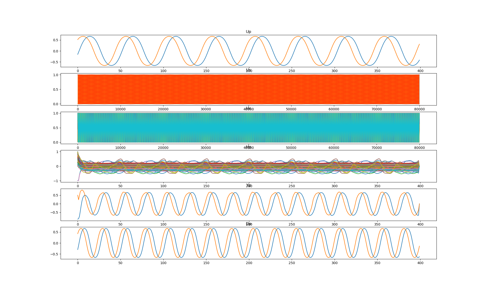  
### Grid search (scan1ds) 
1D grid search on *** alpha_r (min=0.000000 max=1.000000 num=51 samples=20) ***  
Base configuration: `python cbmrc6b3.py display=0 dataset=1 alpha_r=0.100000 alpha_i=0.190000 alpha_s=0.480000 `  
Data:**data20181218_cbmrc6b3_dataset1_scan1ds_alpha_r.csv**  
Start:2018/12/19 01:18:48  
Done :2018/12/19 02:17:18  
Figure:** data20181218_cbmrc6b3_dataset1_scan1ds_alpha_r.png **  
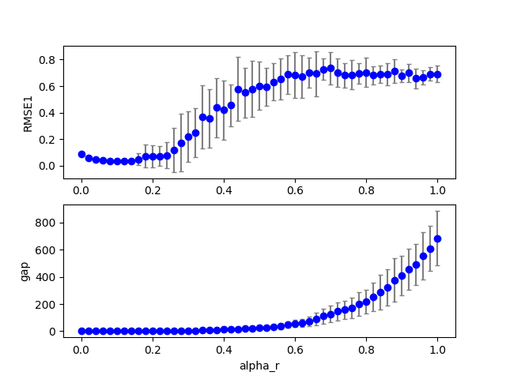  
### Grid search (scan1ds) 
1D grid search on *** alpha_i (min=0.000000 max=1.000000 num=51 samples=20) ***  
Base configuration: `python cbmrc6b3.py display=0 dataset=1 alpha_r=0.100000 alpha_i=0.190000 alpha_s=0.480000 `  
Data:**data20181218_cbmrc6b3_dataset1_scan1ds_alpha_i.csv**  
Start:2018/12/19 02:17:19  
Done :2018/12/19 03:15:00  
Figure:** data20181218_cbmrc6b3_dataset1_scan1ds_alpha_i.png **  
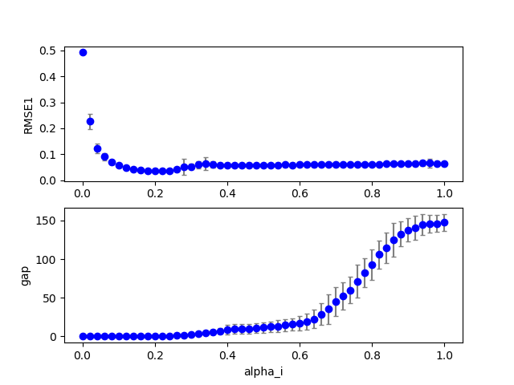  
### Grid search (scan1ds) 
1D grid search on *** alpha_s (min=0.000000 max=1.000000 num=51 samples=20) ***  
Base configuration: `python cbmrc6b3.py display=0 dataset=1 alpha_r=0.100000 alpha_i=0.190000 alpha_s=0.480000 `  
Data:**data20181218_cbmrc6b3_dataset1_scan1ds_alpha_s.csv**  
Start:2018/12/19 03:15:01  
Done :2018/12/19 04:12:41  
Figure:** data20181218_cbmrc6b3_dataset1_scan1ds_alpha_s.png **  
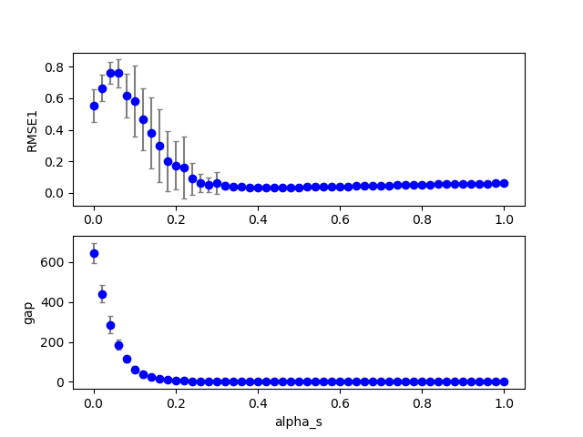  
### Grid search (scan1ds) 
1D grid search on *** beta_i (min=0.000000 max=1.000000 num=51 samples=20) ***  
Base configuration: `python cbmrc6b3.py display=0 dataset=1 alpha_r=0.100000 alpha_i=0.190000 alpha_s=0.480000 `  
Data:**data20181218_cbmrc6b3_dataset1_scan1ds_beta_i.csv**  
Start:2018/12/19 04:12:42  
Done :2018/12/19 05:10:15  
Figure:** data20181218_cbmrc6b3_dataset1_scan1ds_beta_i.png **  
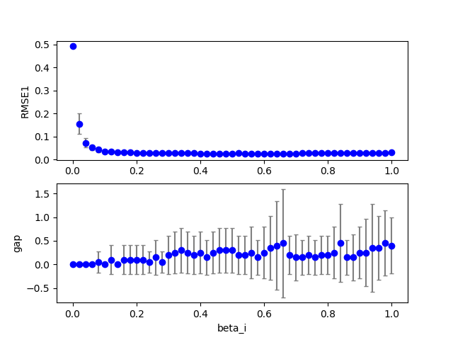  
### Grid search (scan1ds) 
1D grid search on *** beta_r (min=0.000000 max=1.000000 num=51 samples=20) ***  
Base configuration: `python cbmrc6b3.py display=0 dataset=1 alpha_r=0.100000 alpha_i=0.190000 alpha_s=0.480000 `  
Data:**data20181218_cbmrc6b3_dataset1_scan1ds_beta_r.csv**  
Start:2018/12/19 05:10:16  
Done :2018/12/19 06:07:58  
Figure:** data20181218_cbmrc6b3_dataset1_scan1ds_beta_r.png **  
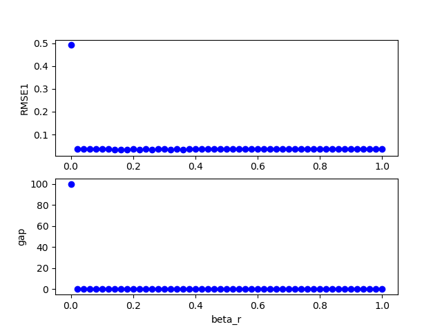  
### Grid search (scan1ds) 
1D grid search on *** Temp (min=0.010000 max=2.000000 num=51 samples=20) ***  
Base configuration: `python cbmrc6b3.py display=0 dataset=1 alpha_r=0.100000 alpha_i=0.190000 alpha_s=0.480000 `  
Data:**data20181218_cbmrc6b3_dataset1_scan1ds_Temp.csv**  
Start:2018/12/19 06:07:58  
Done :2018/12/19 07:05:38  
Figure:** data20181218_cbmrc6b3_dataset1_scan1ds_Temp.png **  
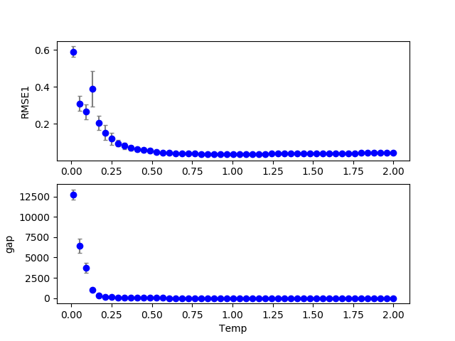  
## cbmrc6b3 (data20181218_cbmrc6b3_dataset2)  
### Optimization 
Configuration:  
```
id      : 0.000000
seed    : 0.000000
alpha_r : 0.200000
alpha_i : 0.200000
alpha_s : 0.200000
TARGET: <function func at 0x7ff260588510> 
iteration: 10 
population: 20 
samples: 20 
```
Start:2018/12/19 07:05:40  
Done :2018/12/19 10:19:43  
Result:  
```
dataset : 2.000000
seed    : 9.500000
NN      :200.000000
Nh      :100.000000
alpha_i : 0.140000
alpha_r : 0.220000
alpha_b : 0.000000
alpha_s : 0.780000
alpha0  : 0.000000
alpha1  : 0.000000
beta_i  : 0.100000
beta_r  : 0.100000
beta_b  : 0.100000
Temp    : 1.000000
lambda0 : 0.100000
RMSE1   : 0.120620
RMSE2   : 0.000000
count_gap: 0.100000
TARGET  : 0.130620
```
Figure:** data20181218_cbmrc6b3_dataset2_test.png **  
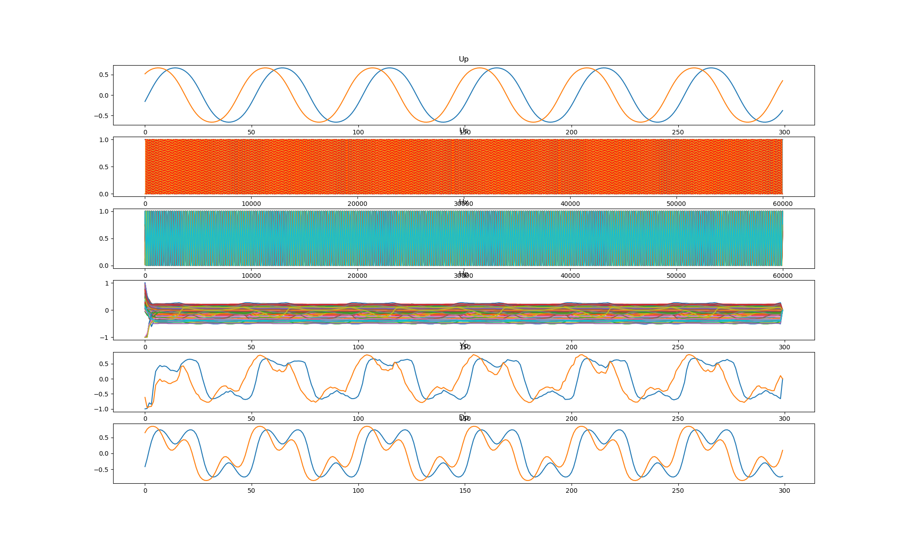  
### Grid search (scan1ds) 
1D grid search on *** alpha_r (min=0.000000 max=1.000000 num=51 samples=20) ***  
Base configuration: `python cbmrc6b3.py display=0 dataset=2 alpha_r=0.220000 alpha_i=0.140000 alpha_s=0.780000 `  
Data:**data20181218_cbmrc6b3_dataset2_scan1ds_alpha_r.csv**  
Start:2018/12/19 10:20:09  
Done :2018/12/19 11:10:16  
Figure:** data20181218_cbmrc6b3_dataset2_scan1ds_alpha_r.png **  
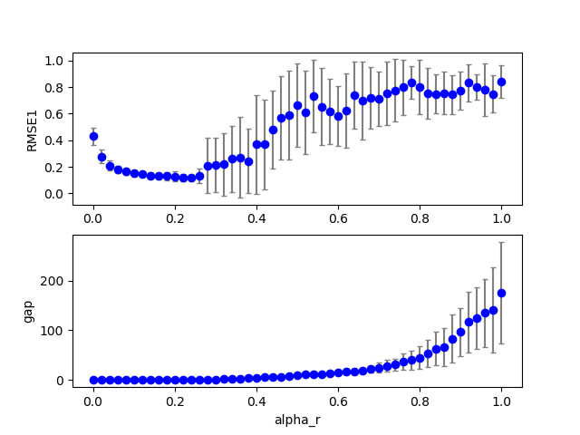  
### Grid search (scan1ds) 
1D grid search on *** alpha_i (min=0.000000 max=1.000000 num=51 samples=20) ***  
Base configuration: `python cbmrc6b3.py display=0 dataset=2 alpha_r=0.220000 alpha_i=0.140000 alpha_s=0.780000 `  
Data:**data20181218_cbmrc6b3_dataset2_scan1ds_alpha_i.csv**  
Start:2018/12/19 11:10:17  
Done :2018/12/19 11:59:44  
Figure:** data20181218_cbmrc6b3_dataset2_scan1ds_alpha_i.png **  
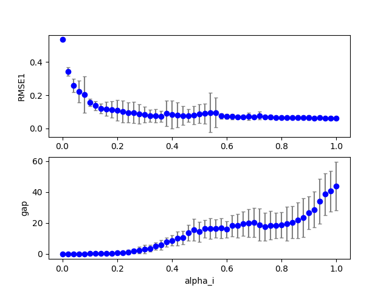  
### Grid search (scan1ds) 
1D grid search on *** alpha_s (min=0.000000 max=1.000000 num=51 samples=20) ***  
Base configuration: `python cbmrc6b3.py display=0 dataset=2 alpha_r=0.220000 alpha_i=0.140000 alpha_s=0.780000 `  
Data:**data20181218_cbmrc6b3_dataset2_scan1ds_alpha_s.csv**  
Start:2018/12/19 11:59:45  
Done :2018/12/19 12:49:17  
Figure:** data20181218_cbmrc6b3_dataset2_scan1ds_alpha_s.png **  
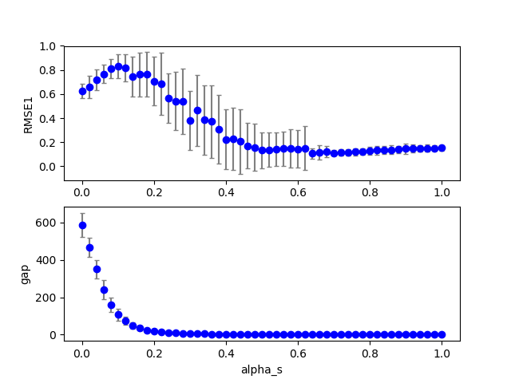  
### Grid search (scan1ds) 
1D grid search on *** beta_i (min=0.000000 max=1.000000 num=51 samples=20) ***  
Base configuration: `python cbmrc6b3.py display=0 dataset=2 alpha_r=0.220000 alpha_i=0.140000 alpha_s=0.780000 `  
Data:**data20181218_cbmrc6b3_dataset2_scan1ds_beta_i.csv**  
Start:2018/12/19 12:49:18  
Done :2018/12/19 13:38:55  
Figure:** data20181218_cbmrc6b3_dataset2_scan1ds_beta_i.png **  
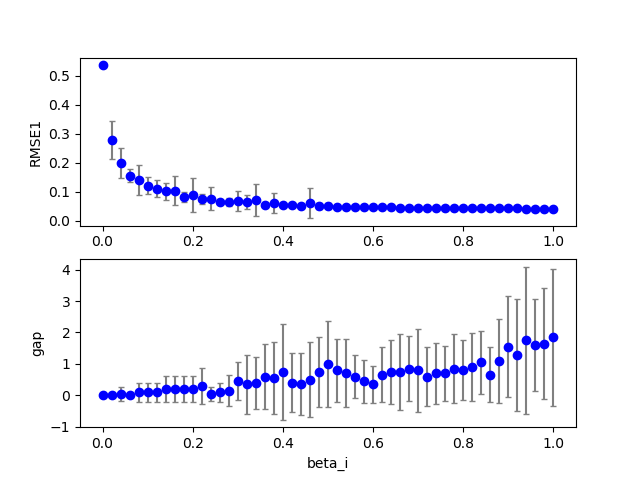  
### Grid search (scan1ds) 
1D grid search on *** beta_r (min=0.000000 max=1.000000 num=51 samples=20) ***  
Base configuration: `python cbmrc6b3.py display=0 dataset=2 alpha_r=0.220000 alpha_i=0.140000 alpha_s=0.780000 `  
Data:**data20181218_cbmrc6b3_dataset2_scan1ds_beta_r.csv**  
Start:2018/12/19 13:38:55  
Done :2018/12/19 14:28:45  
Figure:** data20181218_cbmrc6b3_dataset2_scan1ds_beta_r.png **  
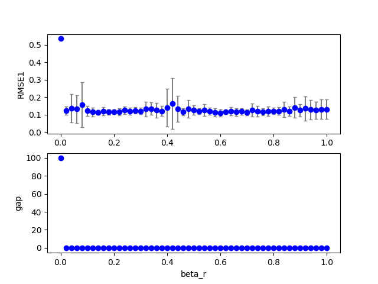  
### Grid search (scan1ds) 
1D grid search on *** Temp (min=0.010000 max=2.000000 num=51 samples=20) ***  
Base configuration: `python cbmrc6b3.py display=0 dataset=2 alpha_r=0.220000 alpha_i=0.140000 alpha_s=0.780000 `  
Data:**data20181218_cbmrc6b3_dataset2_scan1ds_Temp.csv**  
Start:2018/12/19 14:28:46  
Done :2018/12/19 15:18:28  
Figure:** data20181218_cbmrc6b3_dataset2_scan1ds_Temp.png **  
  
## cbmrc6b3 (data20181218_cbmrc6b3_dataset3)  
### Optimization 
Configuration:  
```
id      : 0.000000
seed    : 0.000000
alpha_r : 0.200000
alpha_i : 0.200000
alpha_s : 0.200000
TARGET: <function func at 0x7f3f97327510> 
iteration: 10 
population: 20 
samples: 20 
```
Start:2018/12/19 15:18:31  
Done :2018/12/20 01:53:26  
Result:  
```
dataset : 3.000000
seed    : 9.500000
NN      :200.000000
Nh      :100.000000
alpha_i : 0.110000
alpha_r : 0.000000
alpha_b : 0.000000
alpha_s : 0.130000
alpha0  : 0.000000
alpha1  : 0.000000
beta_i  : 0.100000
beta_r  : 0.100000
beta_b  : 0.100000
Temp    : 1.000000
lambda0 : 0.100000
RMSE1   : 0.274313
RMSE2   : 0.000000
count_gap: 0.000000
TARGET  : 0.274313
```
Figure:** data20181218_cbmrc6b3_dataset3_test.png **  
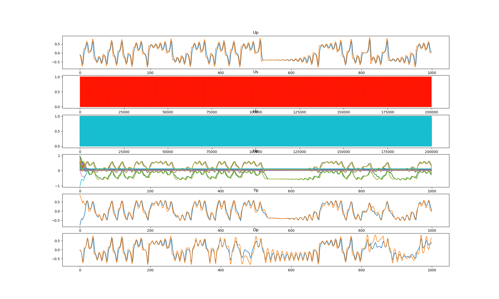  
### Grid search (scan1ds) 
1D grid search on *** alpha_r (min=0.000000 max=1.000000 num=51 samples=20) ***  
Base configuration: `python cbmrc6b3.py display=0 dataset=3 alpha_r=0.000000 alpha_i=0.110000 alpha_s=0.130000 `  
Data:**data20181218_cbmrc6b3_dataset3_scan1ds_alpha_r.csv**  
Start:2018/12/20 01:54:39  
Done :2018/12/20 04:39:07  
Figure:** data20181218_cbmrc6b3_dataset3_scan1ds_alpha_r.png **  
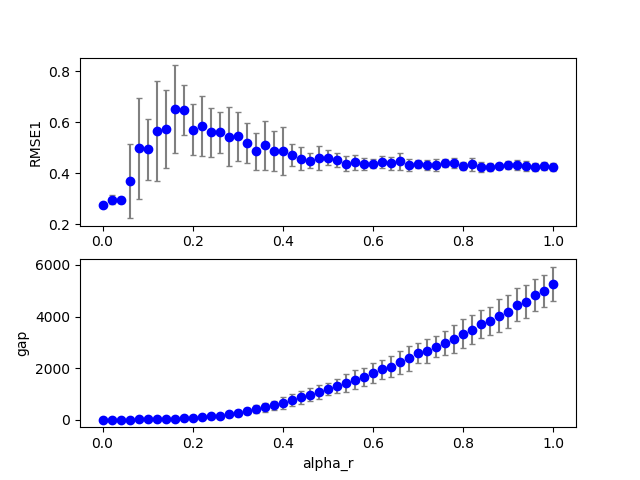  
### Grid search (scan1ds) 
1D grid search on *** alpha_i (min=0.000000 max=1.000000 num=51 samples=20) ***  
Base configuration: `python cbmrc6b3.py display=0 dataset=3 alpha_r=0.000000 alpha_i=0.110000 alpha_s=0.130000 `  
Data:**data20181218_cbmrc6b3_dataset3_scan1ds_alpha_i.csv**  
Start:2018/12/20 04:39:08  
Done :2018/12/20 07:20:38  
Figure:** data20181218_cbmrc6b3_dataset3_scan1ds_alpha_i.png **  
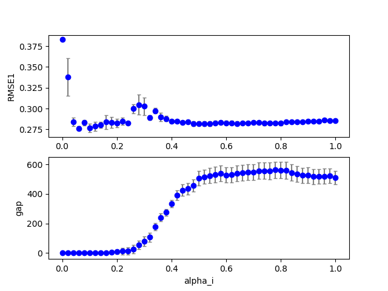  
### Grid search (scan1ds) 
1D grid search on *** alpha_s (min=0.000000 max=1.000000 num=51 samples=20) ***  
Base configuration: `python cbmrc6b3.py display=0 dataset=3 alpha_r=0.000000 alpha_i=0.110000 alpha_s=0.130000 `  
Data:**data20181218_cbmrc6b3_dataset3_scan1ds_alpha_s.csv**  
Start:2018/12/20 07:20:39  
Done :2018/12/20 10:02:30  
Figure:** data20181218_cbmrc6b3_dataset3_scan1ds_alpha_s.png **  
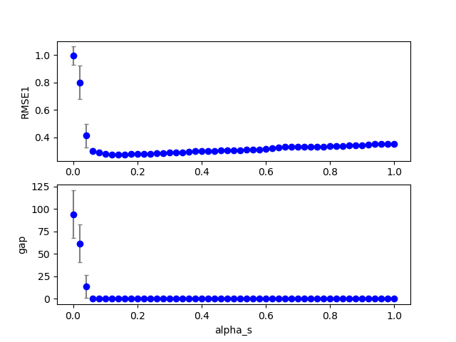  
### Grid search (scan1ds) 
1D grid search on *** beta_i (min=0.000000 max=1.000000 num=51 samples=20) ***  
Base configuration: `python cbmrc6b3.py display=0 dataset=3 alpha_r=0.000000 alpha_i=0.110000 alpha_s=0.130000 `  
Data:**data20181218_cbmrc6b3_dataset3_scan1ds_beta_i.csv**  
Start:2018/12/20 10:02:31  
Done :2018/12/20 12:45:11  
Figure:** data20181218_cbmrc6b3_dataset3_scan1ds_beta_i.png **  
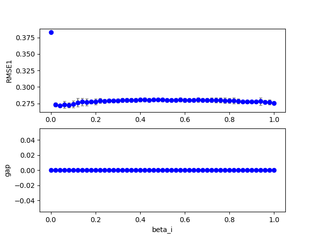  
### Grid search (scan1ds) 
1D grid search on *** beta_r (min=0.000000 max=1.000000 num=51 samples=20) ***  
Base configuration: `python cbmrc6b3.py display=0 dataset=3 alpha_r=0.000000 alpha_i=0.110000 alpha_s=0.130000 `  
Data:**data20181218_cbmrc6b3_dataset3_scan1ds_beta_r.csv**  
Start:2018/12/20 12:45:12  
Done :2018/12/20 15:25:42  
Figure:** data20181218_cbmrc6b3_dataset3_scan1ds_beta_r.png **  
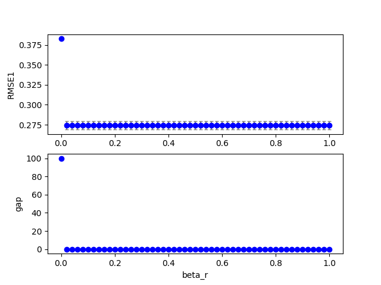  
### Grid search (scan1ds) 
1D grid search on *** Temp (min=0.010000 max=2.000000 num=51 samples=20) ***  
Base configuration: `python cbmrc6b3.py display=0 dataset=3 alpha_r=0.000000 alpha_i=0.110000 alpha_s=0.130000 `  
Data:**data20181218_cbmrc6b3_dataset3_scan1ds_Temp.csv**  
Start:2018/12/20 15:25:43  
Done :2018/12/20 18:06:55  
Figure:** data20181218_cbmrc6b3_dataset3_scan1ds_Temp.png **  
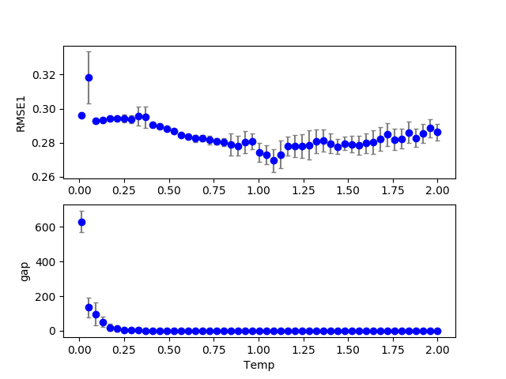  
