## cbmrc6c3 (data20181218_cbmrc6c3_dataset1)  
### Optimization 
Configuration:  
```
id      : 0.000000
seed    : 0.000000
alpha_r : 0.200000
alpha_i : 0.200000
alpha_s : 0.200000
TARGET: <function func at 0x7ff775f45510> 
iteration: 10 
population: 20 
samples: 20 
```
Start:2018/12/21 00:14:01  
Done :2018/12/21 04:09:16  
Result:  
```
dataset : 1.000000
seed    : 9.500000
NN      :200.000000
Nh      :100.000000
alpha_i : 0.670000
alpha_r : 0.490000
alpha_b : 0.000000
alpha_s : 1.500000
alpha0  : 0.000000
alpha1  : 0.000000
beta_i  : 0.100000
beta_r  : 0.100000
beta_b  : 0.100000
Temp    : 1.000000
lambda0 : 0.100000
RMSE1   : 0.055673
RMSE2   : 0.000000
count_gap: 0.000000
TARGET  : 0.055673
```
Figure:** data20181218_cbmrc6c3_dataset1_test.png **  
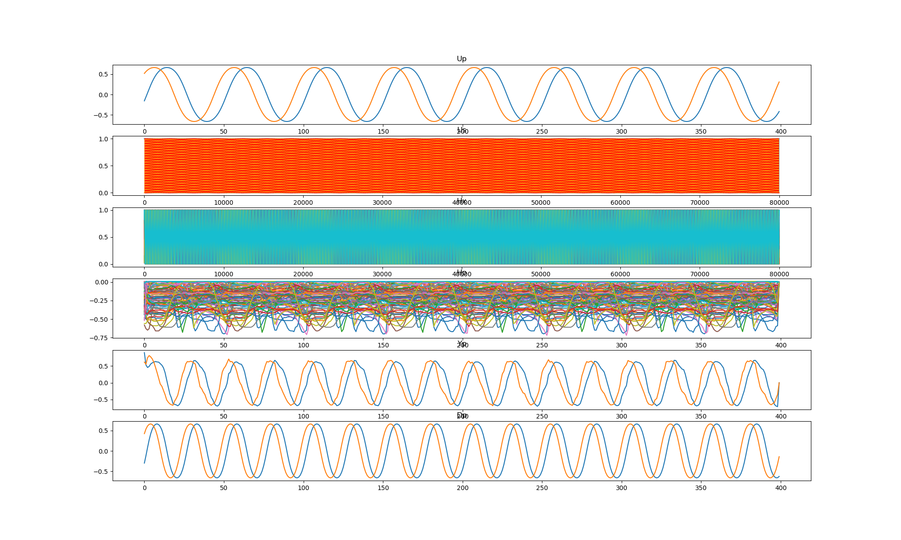  
### Grid search (scan1ds) 
1D grid search on *** alpha_r (min=0.000000 max=1.000000 num=51 samples=20) ***  
Base configuration: `python cbmrc6c3.py display=0 dataset=1 alpha_r=0.490000 alpha_i=0.670000 alpha_s=1.500000 `  
Data:**data20181218_cbmrc6c3_dataset1_scan1ds_alpha_r.csv**  
Start:2018/12/21 04:09:46  
Done :2018/12/21 05:09:54  
Figure:** data20181218_cbmrc6c3_dataset1_scan1ds_alpha_r.png **  
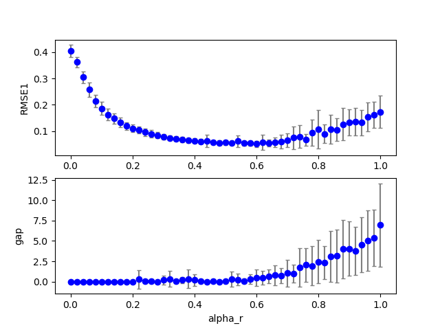  
### Grid search (scan1ds) 
1D grid search on *** alpha_i (min=0.000000 max=1.000000 num=51 samples=20) ***  
Base configuration: `python cbmrc6c3.py display=0 dataset=1 alpha_r=0.490000 alpha_i=0.670000 alpha_s=1.500000 `  
Data:**data20181218_cbmrc6c3_dataset1_scan1ds_alpha_i.csv**  
Start:2018/12/21 05:09:55  
Done :2018/12/21 06:10:13  
Figure:** data20181218_cbmrc6c3_dataset1_scan1ds_alpha_i.png **  
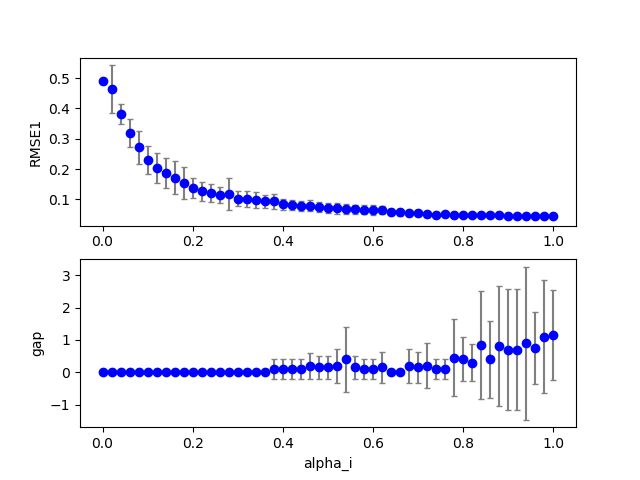  
### Grid search (scan1ds) 
1D grid search on *** alpha_s (min=0.000000 max=2.000000 num=51 samples=20) ***  
Base configuration: `python cbmrc6c3.py display=0 dataset=1 alpha_r=0.490000 alpha_i=0.670000 alpha_s=1.500000 `  
Data:**data20181218_cbmrc6c3_dataset1_scan1ds_alpha_s.csv**  
Start:2018/12/21 06:10:14  
Done :2018/12/21 07:09:43  
Figure:** data20181218_cbmrc6c3_dataset1_scan1ds_alpha_s.png **  
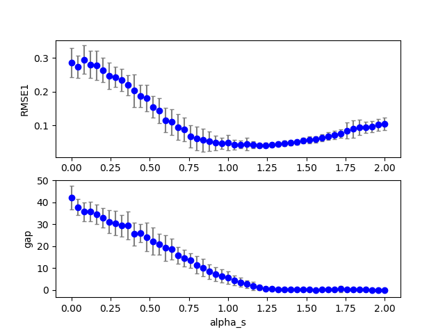  
### Grid search (scan1ds) 
1D grid search on *** beta_i (min=0.000000 max=1.000000 num=51 samples=20) ***  
Base configuration: `python cbmrc6c3.py display=0 dataset=1 alpha_r=0.490000 alpha_i=0.670000 alpha_s=1.500000 `  
Data:**data20181218_cbmrc6c3_dataset1_scan1ds_beta_i.csv**  
Start:2018/12/21 07:09:44  
Done :2018/12/21 08:09:39  
Figure:** data20181218_cbmrc6c3_dataset1_scan1ds_beta_i.png **  
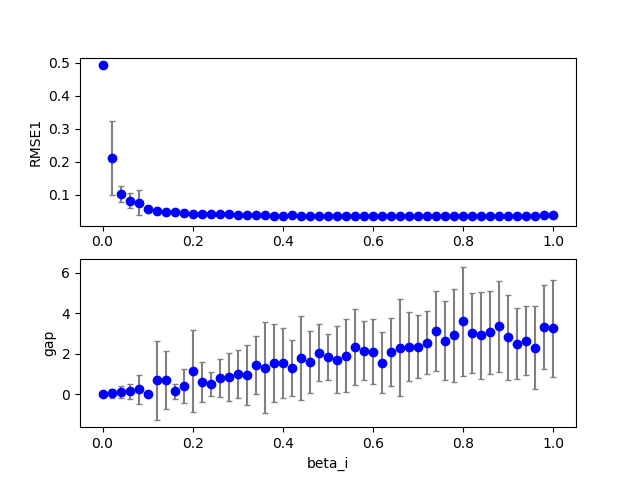  
### Grid search (scan1ds) 
1D grid search on *** beta_r (min=0.000000 max=1.000000 num=51 samples=20) ***  
Base configuration: `python cbmrc6c3.py display=0 dataset=1 alpha_r=0.490000 alpha_i=0.670000 alpha_s=1.500000 `  
Data:**data20181218_cbmrc6c3_dataset1_scan1ds_beta_r.csv**  
Start:2018/12/21 08:09:39  
Done :2018/12/21 09:10:12  
Figure:** data20181218_cbmrc6c3_dataset1_scan1ds_beta_r.png **  
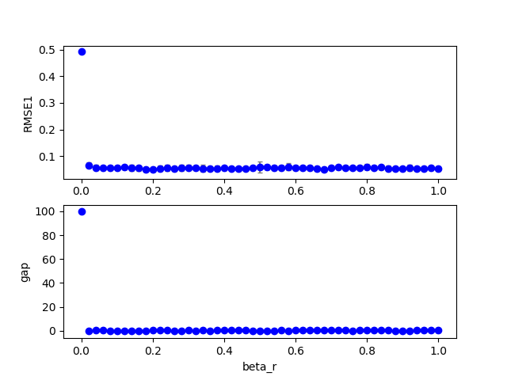  
### Grid search (scan1ds) 
1D grid search on *** Temp (min=0.010000 max=2.000000 num=51 samples=20) ***  
Base configuration: `python cbmrc6c3.py display=0 dataset=1 alpha_r=0.490000 alpha_i=0.670000 alpha_s=1.500000 `  
Data:**data20181218_cbmrc6c3_dataset1_scan1ds_Temp.csv**  
Start:2018/12/21 09:10:13  
Done :2018/12/21 10:09:50  
Figure:** data20181218_cbmrc6c3_dataset1_scan1ds_Temp.png **  
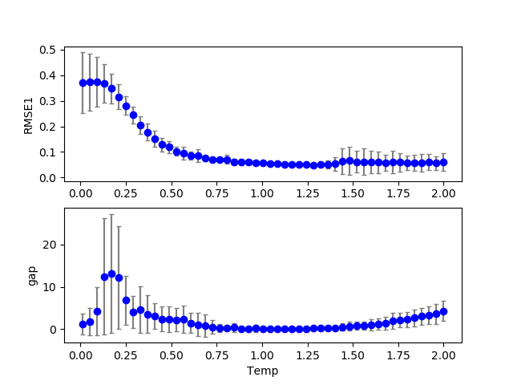  
## cbmrc6c3 (data20181218_cbmrc6c3_dataset2)  
### Optimization 
Configuration:  
```
id      : 0.000000
seed    : 0.000000
alpha_r : 0.200000
alpha_i : 0.200000
alpha_s : 0.200000
TARGET: <function func at 0x7efeb227a510> 
iteration: 10 
population: 20 
samples: 20 
```
Start:2018/12/21 10:09:53  
Done :2018/12/21 13:31:11  
Result:  
```
dataset : 2.000000
seed    : 9.500000
NN      :200.000000
Nh      :100.000000
alpha_i : 0.460000
alpha_r : 0.560000
alpha_b : 0.000000
alpha_s : 1.420000
alpha0  : 0.000000
alpha1  : 0.000000
beta_i  : 0.100000
beta_r  : 0.100000
beta_b  : 0.100000
Temp    : 1.000000
lambda0 : 0.100000
RMSE1   : 0.069204
RMSE2   : 0.000000
count_gap: 0.050000
TARGET  : 0.074204
```
Figure:** data20181218_cbmrc6c3_dataset2_test.png **  
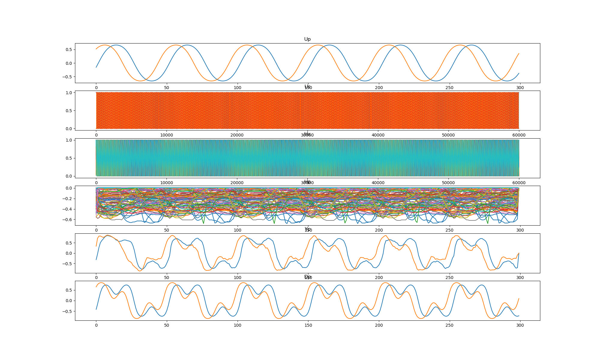  
### Grid search (scan1ds) 
1D grid search on *** alpha_r (min=0.000000 max=1.000000 num=51 samples=20) ***  
Base configuration: `python cbmrc6c3.py display=0 dataset=2 alpha_r=0.560000 alpha_i=0.460000 alpha_s=1.420000 `  
Data:**data20181218_cbmrc6c3_dataset2_scan1ds_alpha_r.csv**  
Start:2018/12/21 13:31:35  
Done :2018/12/21 14:23:18  
Figure:** data20181218_cbmrc6c3_dataset2_scan1ds_alpha_r.png **  
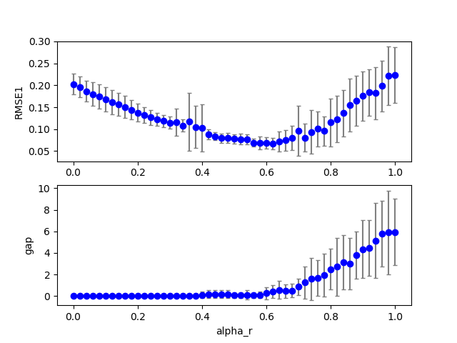  
### Grid search (scan1ds) 
1D grid search on *** alpha_i (min=0.000000 max=1.000000 num=51 samples=20) ***  
Base configuration: `python cbmrc6c3.py display=0 dataset=2 alpha_r=0.560000 alpha_i=0.460000 alpha_s=1.420000 `  
Data:**data20181218_cbmrc6c3_dataset2_scan1ds_alpha_i.csv**  
Start:2018/12/21 14:23:19  
Done :2018/12/21 15:15:14  
Figure:** data20181218_cbmrc6c3_dataset2_scan1ds_alpha_i.png **  
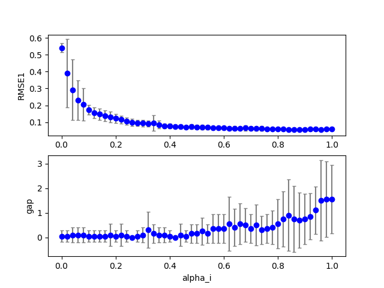  
### Grid search (scan1ds) 
1D grid search on *** alpha_s (min=0.000000 max=2.000000 num=51 samples=20) ***  
Base configuration: `python cbmrc6c3.py display=0 dataset=2 alpha_r=0.560000 alpha_i=0.460000 alpha_s=1.420000 `  
Data:**data20181218_cbmrc6c3_dataset2_scan1ds_alpha_s.csv**  
Start:2018/12/21 15:15:15  
Done :2018/12/21 16:06:46  
Figure:** data20181218_cbmrc6c3_dataset2_scan1ds_alpha_s.png **  
  
### Grid search (scan1ds) 
1D grid search on *** beta_i (min=0.000000 max=1.000000 num=51 samples=20) ***  
Base configuration: `python cbmrc6c3.py display=0 dataset=2 alpha_r=0.560000 alpha_i=0.460000 alpha_s=1.420000 `  
Data:**data20181218_cbmrc6c3_dataset2_scan1ds_beta_i.csv**  
Start:2018/12/21 16:06:47  
Done :2018/12/21 16:58:29  
Figure:** data20181218_cbmrc6c3_dataset2_scan1ds_beta_i.png **  
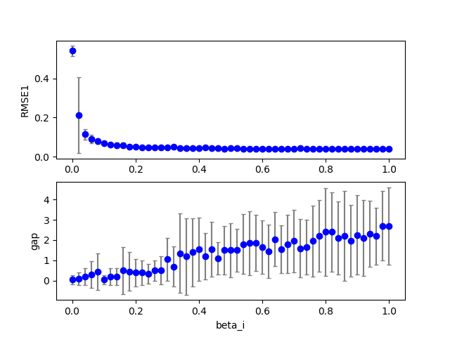  
### Grid search (scan1ds) 
1D grid search on *** beta_r (min=0.000000 max=1.000000 num=51 samples=20) ***  
Base configuration: `python cbmrc6c3.py display=0 dataset=2 alpha_r=0.560000 alpha_i=0.460000 alpha_s=1.420000 `  
Data:**data20181218_cbmrc6c3_dataset2_scan1ds_beta_r.csv**  
Start:2018/12/21 16:58:29  
Done :2018/12/21 17:50:28  
Figure:** data20181218_cbmrc6c3_dataset2_scan1ds_beta_r.png **  
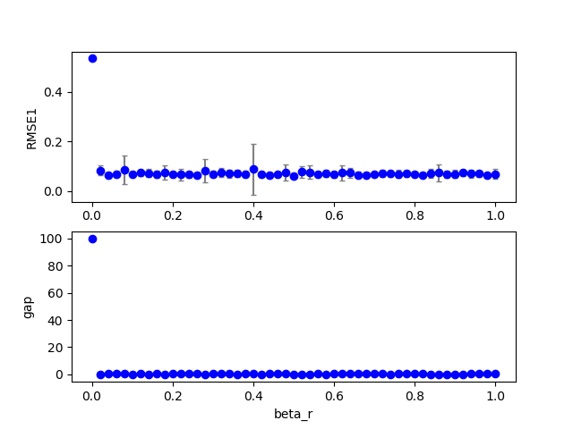  
### Grid search (scan1ds) 
1D grid search on *** Temp (min=0.010000 max=2.000000 num=51 samples=20) ***  
Base configuration: `python cbmrc6c3.py display=0 dataset=2 alpha_r=0.560000 alpha_i=0.460000 alpha_s=1.420000 `  
Data:**data20181218_cbmrc6c3_dataset2_scan1ds_Temp.csv**  
Start:2018/12/21 17:50:29  
Done :2018/12/21 18:41:56  
Figure:** data20181218_cbmrc6c3_dataset2_scan1ds_Temp.png **  
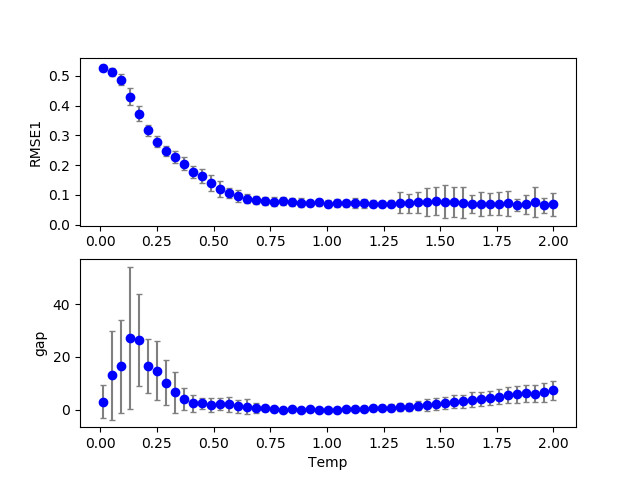  
## cbmrc6c3 (data20181218_cbmrc6c3_dataset3)  
### Optimization 
Configuration:  
```
id      : 0.000000
seed    : 0.000000
alpha_r : 0.200000
alpha_i : 0.200000
alpha_s : 0.200000
TARGET: <function func at 0x7f6d72982510> 
iteration: 10 
population: 20 
samples: 20 
```
Start:2018/12/21 18:41:58  
Done :2018/12/22 05:32:03  
Result:  
```
dataset : 3.000000
seed    : 9.500000
NN      :200.000000
Nh      :100.000000
alpha_i : 0.380000
alpha_r : 0.010000
alpha_b : 0.000000
alpha_s : 0.420000
alpha0  : 0.000000
alpha1  : 0.000000
beta_i  : 0.100000
beta_r  : 0.100000
beta_b  : 0.100000
Temp    : 1.000000
lambda0 : 0.100000
RMSE1   : 0.284605
RMSE2   : 0.000000
count_gap: 0.000000
TARGET  : 0.284605
```
Figure:** data20181218_cbmrc6c3_dataset3_test.png **  
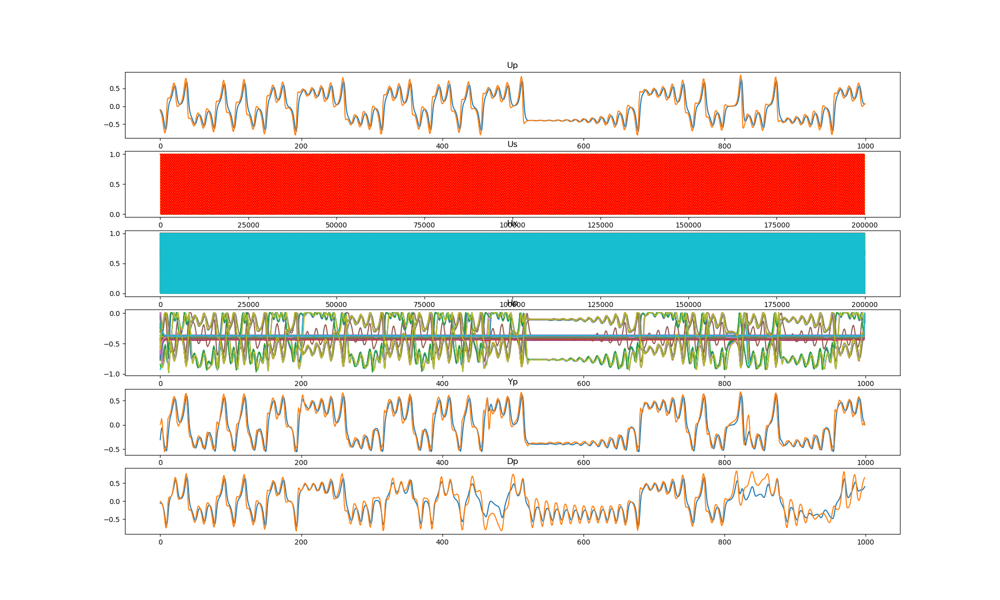  
### Grid search (scan1ds) 
1D grid search on *** alpha_r (min=0.000000 max=1.000000 num=51 samples=20) ***  
Base configuration: `python cbmrc6c3.py display=0 dataset=3 alpha_r=0.010000 alpha_i=0.380000 alpha_s=0.420000 `  
Data:**data20181218_cbmrc6c3_dataset3_scan1ds_alpha_r.csv**  
Start:2018/12/22 05:33:19  
Done :2018/12/22 08:17:22  
Figure:** data20181218_cbmrc6c3_dataset3_scan1ds_alpha_r.png **  
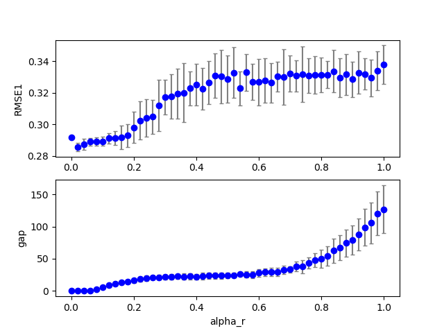  
### Grid search (scan1ds) 
1D grid search on *** alpha_i (min=0.000000 max=1.000000 num=51 samples=20) ***  
Base configuration: `python cbmrc6c3.py display=0 dataset=3 alpha_r=0.010000 alpha_i=0.380000 alpha_s=0.420000 `  
Data:**data20181218_cbmrc6c3_dataset3_scan1ds_alpha_i.csv**  
Start:2018/12/22 08:17:22  
Done :2018/12/22 11:01:43  
Figure:** data20181218_cbmrc6c3_dataset3_scan1ds_alpha_i.png **  
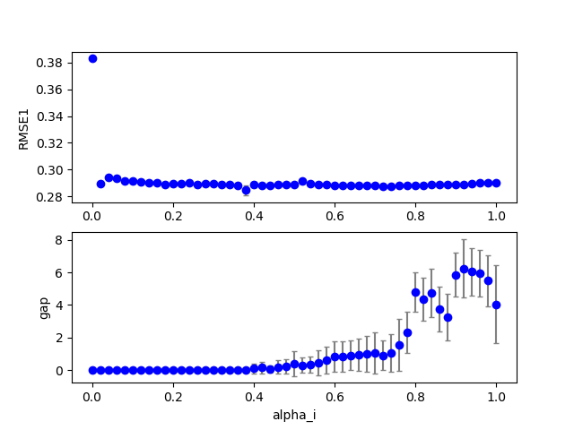  
### Grid search (scan1ds) 
1D grid search on *** alpha_s (min=0.000000 max=2.000000 num=51 samples=20) ***  
Base configuration: `python cbmrc6c3.py display=0 dataset=3 alpha_r=0.010000 alpha_i=0.380000 alpha_s=0.420000 `  
Data:**data20181218_cbmrc6c3_dataset3_scan1ds_alpha_s.csv**  
Start:2018/12/22 11:01:44  
Done :2018/12/22 13:48:18  
Figure:** data20181218_cbmrc6c3_dataset3_scan1ds_alpha_s.png **  
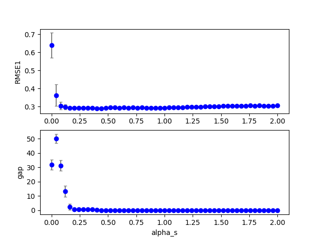  
### Grid search (scan1ds) 
1D grid search on *** beta_i (min=0.000000 max=1.000000 num=51 samples=20) ***  
Base configuration: `python cbmrc6c3.py display=0 dataset=3 alpha_r=0.010000 alpha_i=0.380000 alpha_s=0.420000 `  
Data:**data20181218_cbmrc6c3_dataset3_scan1ds_beta_i.csv**  
Start:2018/12/22 13:48:19  
Done :2018/12/22 16:33:03  
Figure:** data20181218_cbmrc6c3_dataset3_scan1ds_beta_i.png **  
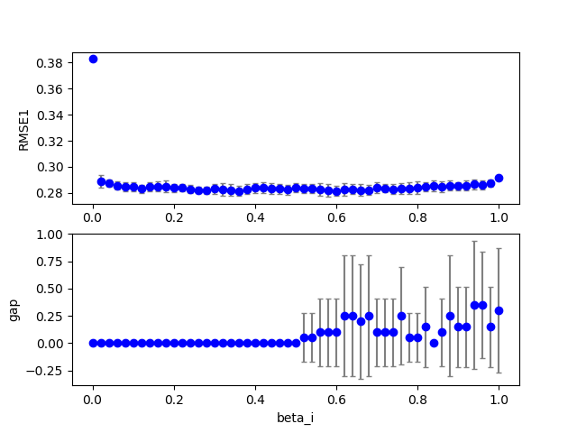  
### Grid search (scan1ds) 
1D grid search on *** beta_r (min=0.000000 max=1.000000 num=51 samples=20) ***  
Base configuration: `python cbmrc6c3.py display=0 dataset=3 alpha_r=0.010000 alpha_i=0.380000 alpha_s=0.420000 `  
Data:**data20181218_cbmrc6c3_dataset3_scan1ds_beta_r.csv**  
Start:2018/12/22 16:33:04  
Done :2018/12/22 19:16:43  
Figure:** data20181218_cbmrc6c3_dataset3_scan1ds_beta_r.png **  
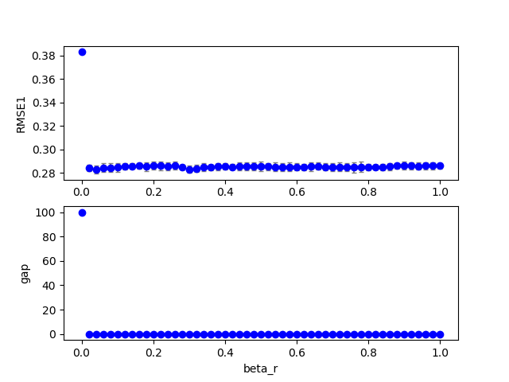  
### Grid search (scan1ds) 
1D grid search on *** Temp (min=0.010000 max=2.000000 num=51 samples=20) ***  
Base configuration: `python cbmrc6c3.py display=0 dataset=3 alpha_r=0.010000 alpha_i=0.380000 alpha_s=0.420000 `  
Data:**data20181218_cbmrc6c3_dataset3_scan1ds_Temp.csv**  
Start:2018/12/22 19:16:43  
Done :2018/12/22 22:02:03  
Figure:** data20181218_cbmrc6c3_dataset3_scan1ds_Temp.png **  
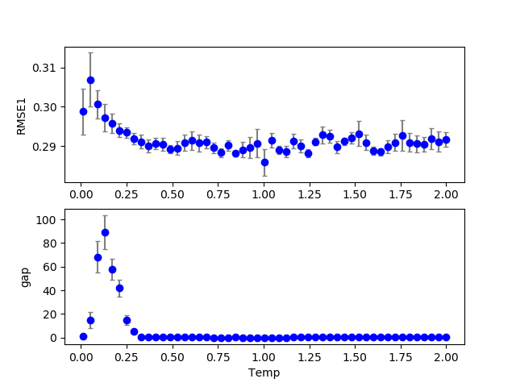  
