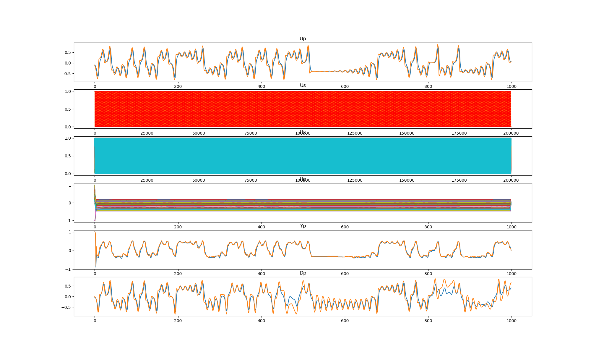

## cbmrc6b3 (data20181220_cbmrc6b3_dataset3)  
### Optimization 
Configuration:  
```
id      : 0.000000
seed    : 0.000000
alpha_r : 0.100000
alpha_i : 0.100000
alpha_s : 0.200000
TARGET: <function func at 0x7f2759d52d08> 
iteration: 10 
population: 20 
samples: 20 
```
Start:2018/12/20 09:00:02  
Done :2018/12/20 14:23:18  
Result:  
```
dataset : 3.000000
seed    : 9.500000
NN      :200.000000
Nh      :100.000000
alpha_i : 0.030000
alpha_r : 0.200000
alpha_b : 0.000000
alpha_s : 0.820000
alpha0  : 0.000000
alpha1  : 0.000000
beta_i  : 0.100000
beta_r  : 0.100000
beta_b  : 0.100000
Temp    : 1.000000
lambda0 : 0.100000
RMSE1   : 0.287870
RMSE2   : 0.000000
count_gap: 0.000000
TARGET  : 0.287870
```
Figure:** data20181220_cbmrc6b3_dataset3_test.png **  
  
