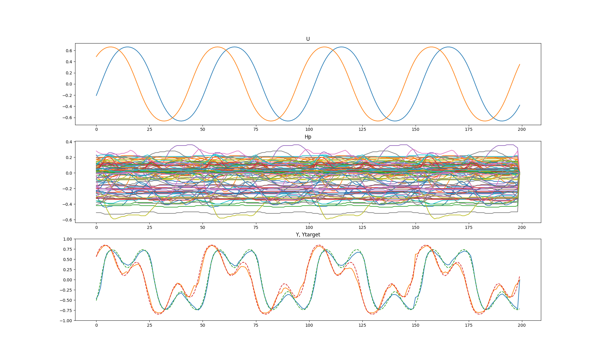
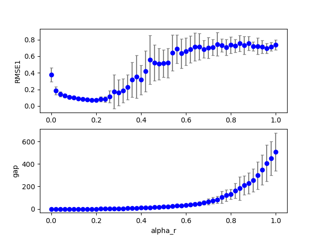
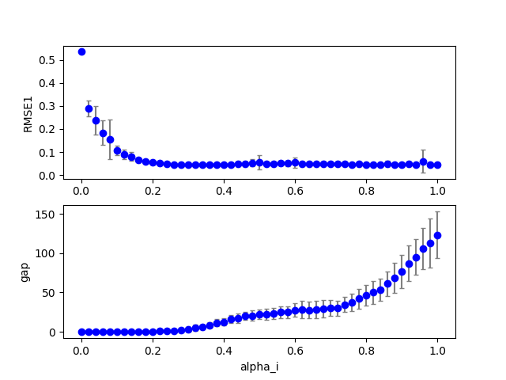
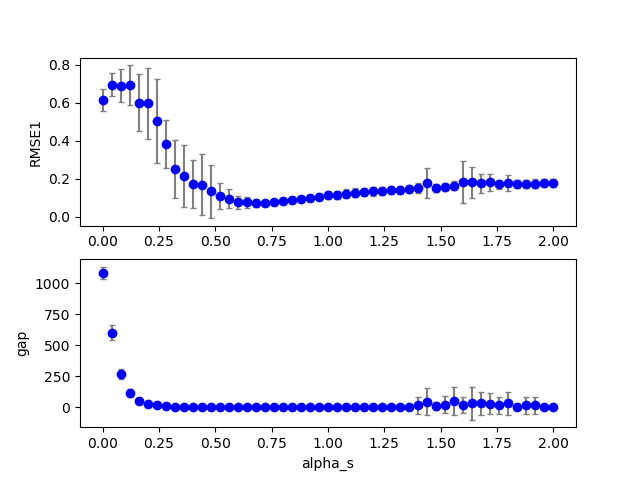
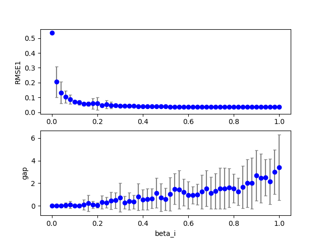
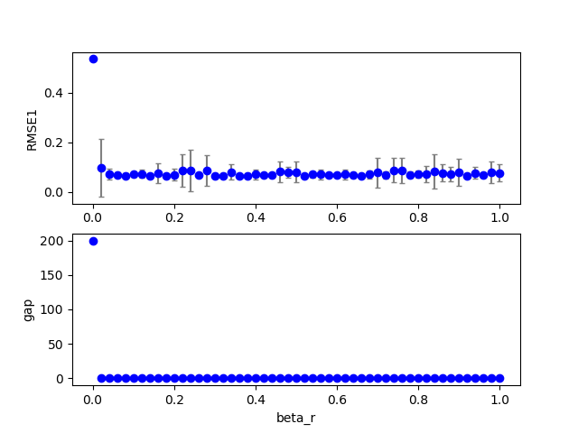
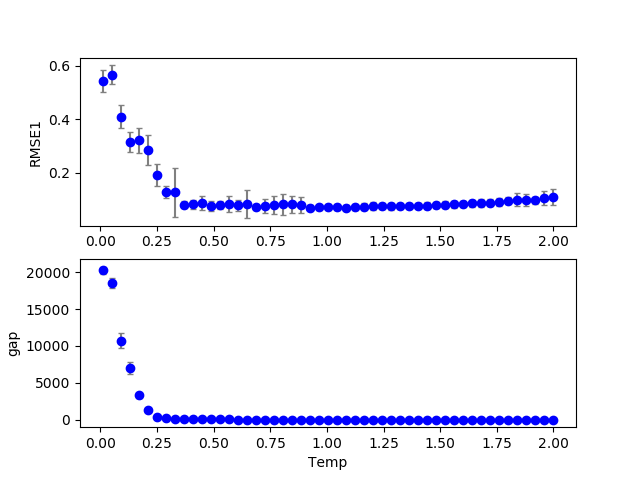

## data20190110_cbmrc6b4_ds2  gridscan 
Figure:** data20190110_cbmrc6b4_ds2a_exe1.png **  
  
Configuration:  
```
dataset: 2.0
seed: 0.0
id: 0.0
NN: 200.0
Nh: 200.0
alpha_i: 0.15
alpha_r: 0.2
alpha_b: 0.0
alpha_s: 0.7
alpha0: 0.0
alpha1: 0.0
beta_i: 0.1
beta_r: 0.1
beta_b: 0.1
Temp: 1.0
lambda0: 0.1
RMSE1: 0.063701
RMSE2: 0.0
count_gap: 0.0
overflow: 0.0
```
### Grid search (scan1ds) 
1D grid search on *** alpha_r (min=0.000000 max=1.000000 num=51 samples=20) ***  
Base configuration: `python cbmrc6b4.py display=0 dataset=2 `  
Data:**data20190110_cbmrc6b4_ds2_scan1ds_alpha_r.csv**  
Start:2019/01/11 01:55:11  
Done :2019/01/11 07:15:50  
Figure:** data20190110_cbmrc6b4_ds2_scan1ds_alpha_r.png **  
  
### Grid search (scan1ds) 
1D grid search on *** alpha_i (min=0.000000 max=1.000000 num=51 samples=20) ***  
Base configuration: `python cbmrc6b4.py display=0 dataset=2 `  
Data:**data20190110_cbmrc6b4_ds2_scan1ds_alpha_i.csv**  
Start:2019/01/11 07:15:51  
Done :2019/01/11 12:30:34  
Figure:** data20190110_cbmrc6b4_ds2_scan1ds_alpha_i.png **  
  
### Grid search (scan1ds) 
1D grid search on *** alpha_s (min=0.000000 max=2.000000 num=51 samples=20) ***  
Base configuration: `python cbmrc6b4.py display=0 dataset=2 `  
Data:**data20190110_cbmrc6b4_ds2_scan1ds_alpha_s.csv**  
Start:2019/01/11 12:30:34  
Done :2019/01/11 17:45:18  
Figure:** data20190110_cbmrc6b4_ds2_scan1ds_alpha_s.png **  
  
### Grid search (scan1ds) 
1D grid search on *** beta_i (min=0.000000 max=1.000000 num=51 samples=20) ***  
Base configuration: `python cbmrc6b4.py display=0 dataset=2 `  
Data:**data20190110_cbmrc6b4_ds2_scan1ds_beta_i.csv**  
Start:2019/01/11 17:45:19  
Done :2019/01/11 22:59:51  
Figure:** data20190110_cbmrc6b4_ds2_scan1ds_beta_i.png **  
  
### Grid search (scan1ds) 
1D grid search on *** beta_r (min=0.000000 max=1.000000 num=51 samples=20) ***  
Base configuration: `python cbmrc6b4.py display=0 dataset=2 `  
Data:**data20190110_cbmrc6b4_ds2_scan1ds_beta_r.csv**  
Start:2019/01/11 22:59:52  
Done :2019/01/12 04:11:57  
Figure:** data20190110_cbmrc6b4_ds2_scan1ds_beta_r.png **  
  
### Grid search (scan1ds) 
1D grid search on *** Temp (min=0.010000 max=2.000000 num=51 samples=20) ***  
Base configuration: `python cbmrc6b4.py display=0 dataset=2 `  
Data:**data20190110_cbmrc6b4_ds2_scan1ds_Temp.csv**  
Start:2019/01/12 04:11:58  
Done :2019/01/12 09:25:30  
Figure:** data20190110_cbmrc6b4_ds2_scan1ds_Temp.png **  
  
