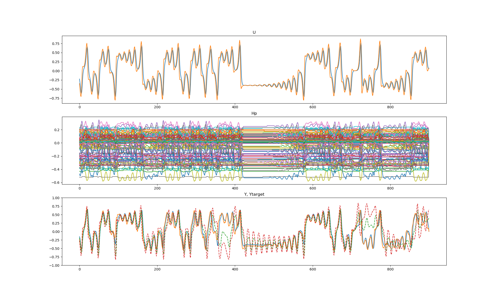
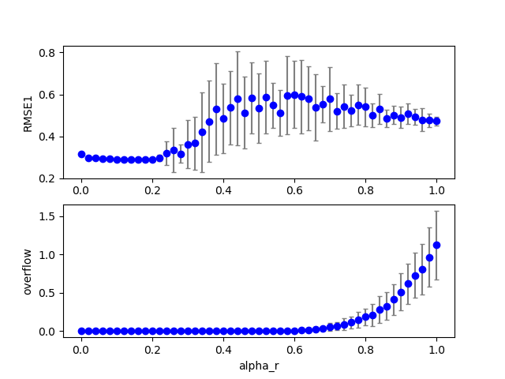
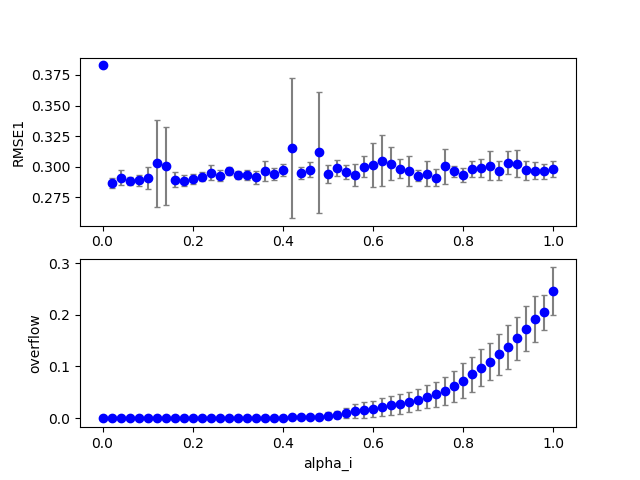

## data20190110_cbmrc6b4_ds3  gridscan 
Figure:** data20190110_cbmrc6b4_ds3a_exe1.png **  
  
Configuration:  
```
dataset: 3.0
seed: 0.0
id: 0.0
NN: 200.0
Nh: 200.0
alpha_i: 0.15
alpha_r: 0.2
alpha_b: 0.0
alpha_s: 0.7
alpha0: 0.0
alpha1: 0.0
beta_i: 0.1
beta_r: 0.1
beta_b: 0.1
Temp: 1.0
lambda0: 0.1
RMSE1: 0.289014
RMSE2: 0.0
count_gap: 0.0
overflow: 0.0
```
### Grid search (scan1ds) 
1D grid search on *** alpha_r (min=0.000000 max=1.000000 num=51 samples=20) ***  
Base configuration: `python cbmrc6b4.py display=0 dataset=3 `  
Data:**data20190110_cbmrc6b4_ds3_scan1ds_alpha_r.csv**  
Start:2019/01/11 02:02:44  
Done :2019/01/12 04:25:01  
Figure:** data20190110_cbmrc6b4_ds3_scan1ds_alpha_r.png **  
  
### Grid search (scan1ds) 
1D grid search on *** alpha_i (min=0.000000 max=1.000000 num=51 samples=20) ***  
Base configuration: `python cbmrc6b4.py display=0 dataset=3 `  
Data:**data20190110_cbmrc6b4_ds3_scan1ds_alpha_i.csv**  
Start:2019/01/12 04:25:02  
Done :2019/01/12 15:35:57  
Figure:** data20190110_cbmrc6b4_ds3_scan1ds_alpha_i.png **  
  
### Grid search (scan1ds) 
1D grid search on *** alpha_s (min=0.000000 max=2.000000 num=51 samples=20) ***  
Base configuration: `python cbmrc6b4.py display=0 dataset=3 `  
Data:**data20190110_cbmrc6b4_ds3_scan1ds_alpha_s.csv**  
Start:2019/01/12 15:35:57  
Done :2019/01/12 16:54:42  
