## esn1 (data20190113_esn1_ds1)  
### Grid search (scan1ds) 
1D grid search on *** alpha_r (min=0.000000 max=2.000000 num=51 samples=20) ***  
Base configuration: `python esn1.py display=0 dataset=1 `  
Data:**data20190113_esn1_ds1_scan1ds_alpha_r.csv**  
Start:2019/01/13 18:51:19  
Done :2019/01/13 18:52:12  
Figure:** data20190113_esn1_ds1_scan1ds_alpha_r.png **  
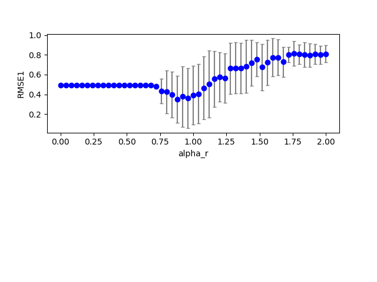  
### Grid search (scan1ds) 
1D grid search on *** alpha_i (min=0.000000 max=1.000000 num=51 samples=20) ***  
Base configuration: `python esn1.py display=0 dataset=1 `  
Data:**data20190113_esn1_ds1_scan1ds_alpha_i.csv**  
Start:2019/01/13 18:52:12  
Done :2019/01/13 18:53:05  
Figure:** data20190113_esn1_ds1_scan1ds_alpha_i.png **  
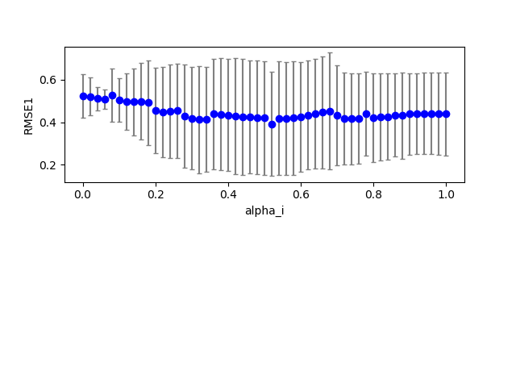  
### Grid search (scan1ds) 
1D grid search on *** alpha0 (min=0.000000 max=1.000000 num=51 samples=20) ***  
Base configuration: `python esn1.py display=0 dataset=1 `  
Data:**data20190113_esn1_ds1_scan1ds_alpha0.csv**  
Start:2019/01/13 18:53:05  
Done :2019/01/13 18:53:57  
Figure:** data20190113_esn1_ds1_scan1ds_alpha0.png **  
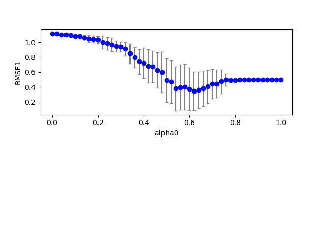  
### Grid search (scan1ds) 
1D grid search on *** tau (min=1.000000 max=2.000000 num=51 samples=20) ***  
Base configuration: `python esn1.py display=0 dataset=1 `  
Data:**data20190113_esn1_ds1_scan1ds_tau.csv**  
Start:2019/01/13 18:53:57  
Done :2019/01/13 18:54:51  
Figure:** data20190113_esn1_ds1_scan1ds_tau.png **  
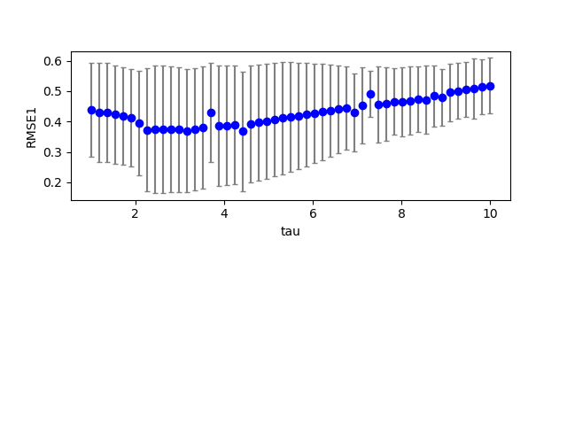  
### Grid search (scan1ds) 
1D grid search on *** beta_i (min=0.000000 max=1.000000 num=51 samples=20) ***  
Base configuration: `python esn1.py display=0 dataset=1 `  
Data:**data20190113_esn1_ds1_scan1ds_beta_i.csv**  
Start:2019/01/13 18:54:51  
Done :2019/01/13 18:55:44  
Figure:** data20190113_esn1_ds1_scan1ds_beta_i.png **  
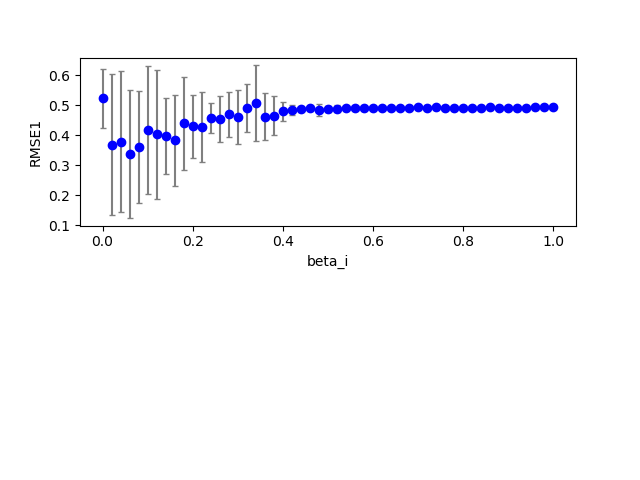  
### Grid search (scan1ds) 
1D grid search on *** beta_r (min=0.000000 max=1.000000 num=51 samples=20) ***  
Base configuration: `python esn1.py display=0 dataset=1 `  
Data:**data20190113_esn1_ds1_scan1ds_beta_r.csv**  
Start:2019/01/13 18:55:44  
Done :2019/01/13 18:56:36  
Figure:** data20190113_esn1_ds1_scan1ds_beta_r.png **  
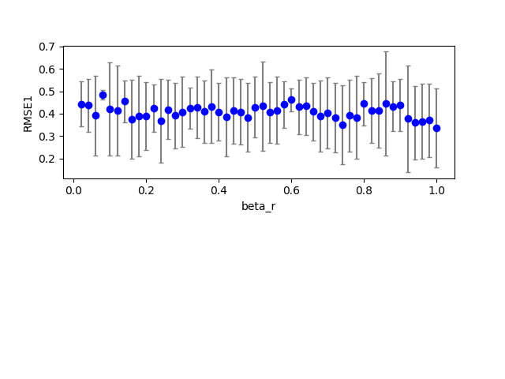  
## esn1 (data20190113_esn1_ds2)  
### Grid search (scan1ds) 
1D grid search on *** alpha_r (min=0.000000 max=2.000000 num=51 samples=20) ***  
Base configuration: `python esn1.py display=0 dataset=2 `  
Data:**data20190113_esn1_ds2_scan1ds_alpha_r.csv**  
Start:2019/01/13 18:56:59  
Done :2019/01/13 18:57:52  
Figure:** data20190113_esn1_ds2_scan1ds_alpha_r.png **  
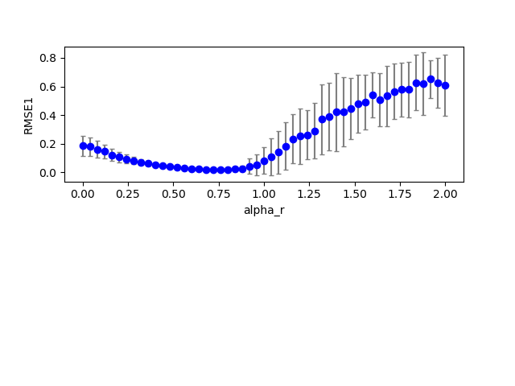  
### Grid search (scan1ds) 
1D grid search on *** alpha_i (min=0.000000 max=1.000000 num=51 samples=20) ***  
Base configuration: `python esn1.py display=0 dataset=2 `  
Data:**data20190113_esn1_ds2_scan1ds_alpha_i.csv**  
Start:2019/01/13 18:57:52  
Done :2019/01/13 18:58:25  
Figure:** data20190113_esn1_ds2_scan1ds_alpha_i.png **  
  
### Grid search (scan1ds) 
1D grid search on *** alpha0 (min=0.000000 max=1.000000 num=51 samples=20) ***  
Base configuration: `python esn1.py display=0 dataset=2 `  
Data:**data20190113_esn1_ds2_scan1ds_alpha0.csv**  
Start:2019/01/13 18:58:26  
Done :2019/01/13 18:59:20  
Figure:** data20190113_esn1_ds2_scan1ds_alpha0.png **  
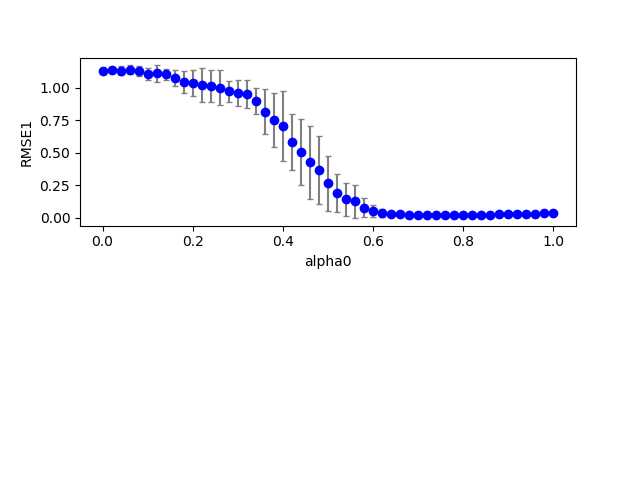  
### Grid search (scan1ds) 
1D grid search on *** tau (min=1.000000 max=2.000000 num=51 samples=20) ***  
Base configuration: `python esn1.py display=0 dataset=2 `  
Data:**data20190113_esn1_ds2_scan1ds_tau.csv**  
Start:2019/01/13 18:59:20  
Done :2019/01/13 19:00:13  
Figure:** data20190113_esn1_ds2_scan1ds_tau.png **  
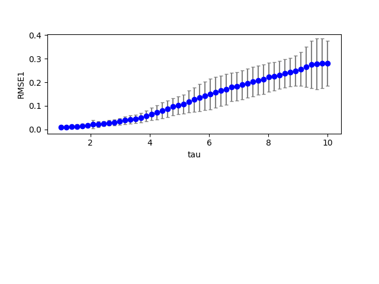  
### Grid search (scan1ds) 
1D grid search on *** beta_i (min=0.000000 max=1.000000 num=51 samples=20) ***  
Base configuration: `python esn1.py display=0 dataset=2 `  
Data:**data20190113_esn1_ds2_scan1ds_beta_i.csv**  
Start:2019/01/13 19:00:13  
Done :2019/01/13 19:01:06  
Figure:** data20190113_esn1_ds2_scan1ds_beta_i.png **  
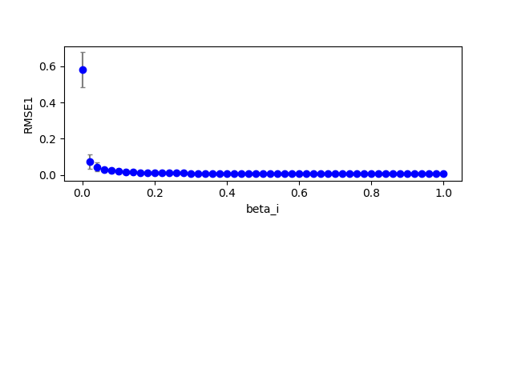  
### Grid search (scan1ds) 
1D grid search on *** beta_r (min=0.000000 max=1.000000 num=51 samples=20) ***  
Base configuration: `python esn1.py display=0 dataset=2 `  
Data:**data20190113_esn1_ds2_scan1ds_beta_r.csv**  
Start:2019/01/13 19:01:06  
Done :2019/01/13 19:01:59  
Figure:** data20190113_esn1_ds2_scan1ds_beta_r.png **  
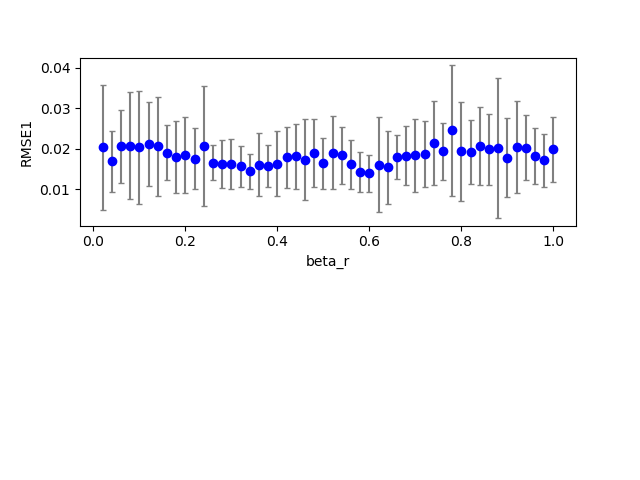  
## esn1 (data20190113_esn1_ds3)  
### Grid search (scan1ds) 
1D grid search on *** alpha_r (min=0.000000 max=2.000000 num=51 samples=20) ***  
Base configuration: `python esn1.py display=0 dataset=3 `  
Data:**data20190113_esn1_ds3_scan1ds_alpha_r.csv**  
Start:2019/01/13 19:02:38  
Done :2019/01/13 19:03:43  
Figure:** data20190113_esn1_ds3_scan1ds_alpha_r.png **  
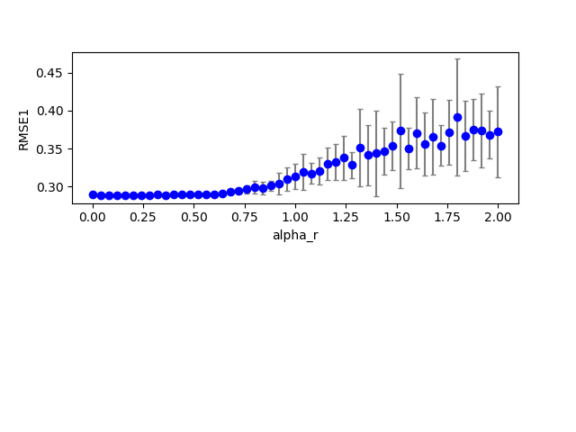  
### Grid search (scan1ds) 
1D grid search on *** alpha_i (min=0.000000 max=1.000000 num=51 samples=20) ***  
Base configuration: `python esn1.py display=0 dataset=3 `  
Data:**data20190113_esn1_ds3_scan1ds_alpha_i.csv**  
Start:2019/01/13 19:03:43  
Done :2019/01/13 19:04:49  
Figure:** data20190113_esn1_ds3_scan1ds_alpha_i.png **  
  
### Grid search (scan1ds) 
1D grid search on *** alpha0 (min=0.000000 max=1.000000 num=51 samples=20) ***  
Base configuration: `python esn1.py display=0 dataset=3 `  
Data:**data20190113_esn1_ds3_scan1ds_alpha0.csv**  
Start:2019/01/13 19:04:49  
Done :2019/01/13 19:05:54  
Figure:** data20190113_esn1_ds3_scan1ds_alpha0.png **  
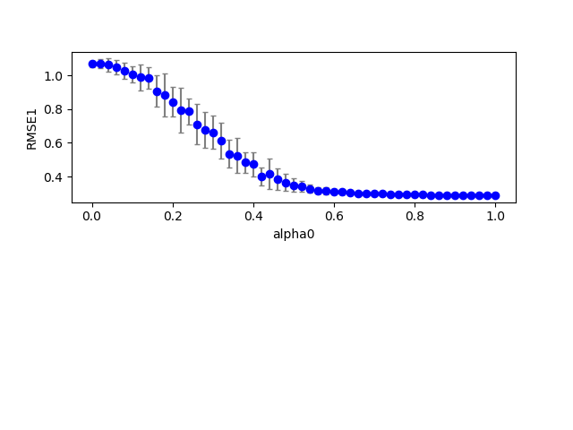  
### Grid search (scan1ds) 
1D grid search on *** tau (min=1.000000 max=2.000000 num=51 samples=20) ***  
Base configuration: `python esn1.py display=0 dataset=3 `  
Data:**data20190113_esn1_ds3_scan1ds_tau.csv**  
Start:2019/01/13 19:05:55  
Done :2019/01/13 19:07:00  
Figure:** data20190113_esn1_ds3_scan1ds_tau.png **  
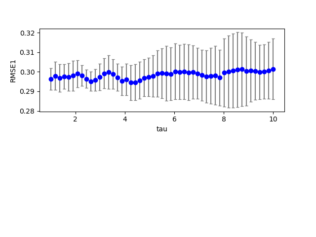  
### Grid search (scan1ds) 
1D grid search on *** beta_i (min=0.000000 max=1.000000 num=51 samples=20) ***  
Base configuration: `python esn1.py display=0 dataset=3 `  
Data:**data20190113_esn1_ds3_scan1ds_beta_i.csv**  
Start:2019/01/13 19:07:00  
Done :2019/01/13 19:08:06  
Figure:** data20190113_esn1_ds3_scan1ds_beta_i.png **  
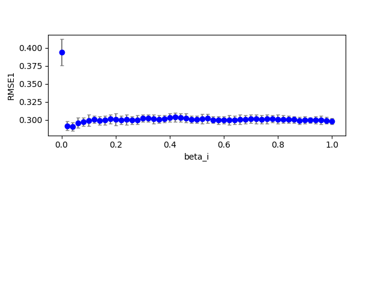  
### Grid search (scan1ds) 
1D grid search on *** beta_r (min=0.000000 max=1.000000 num=51 samples=20) ***  
Base configuration: `python esn1.py display=0 dataset=3 `  
Data:**data20190113_esn1_ds3_scan1ds_beta_r.csv**  
Start:2019/01/13 19:08:06  
Done :2019/01/13 19:08:24  
Figure:** data20190113_esn1_ds3_scan1ds_beta_r.png **  
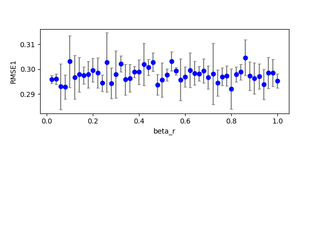  
## esn1 (data20190113_esn1_ds1)  
## esn1 (data20190113_esn1_ds1)  
### Grid search (scan1ds) 
1D grid search on *** tau (min=1.000000 max=10.000000 num=51 samples=20) ***  
Base configuration: `python esn1.py display=0 dataset=1 `  
Data:**data20190113_esn1_ds1_scan1ds_tau.csv**  
Start:2019/01/13 19:36:59  
## esn1 (data20190113_esn1_ds1)  
### Grid search (scan1ds) 
1D grid search on *** tau (min=1.000000 max=10.000000 num=51 samples=20) ***  
Base configuration: `python esn1.py display=0 dataset=1 `  
Data:**data20190113_esn1_ds1_scan1ds_tau.csv**  
Start:2019/01/13 19:37:55  
Done :2019/01/13 19:38:16  
Figure:** data20190113_esn1_ds1_scan1ds_tau.png **  
  
## esn1 (data20190113_esn1_ds2)  
### Grid search (scan1ds) 
1D grid search on *** tau (min=1.000000 max=10.000000 num=51 samples=20) ***  
Base configuration: `python esn1.py display=0 dataset=2 `  
Data:**data20190113_esn1_ds2_scan1ds_tau.csv**  
Start:2019/01/13 19:38:19  
Done :2019/01/13 19:39:12  
Figure:** data20190113_esn1_ds2_scan1ds_tau.png **  
  
## esn1 (data20190113_esn1_ds3)  
### Grid search (scan1ds) 
1D grid search on *** tau (min=1.000000 max=10.000000 num=51 samples=20) ***  
Base configuration: `python esn1.py display=0 dataset=3 `  
Data:**data20190113_esn1_ds3_scan1ds_tau.csv**  
Start:2019/01/13 19:39:21  
Done :2019/01/13 19:40:27  
Figure:** data20190113_esn1_ds3_scan1ds_tau.png **  
  
