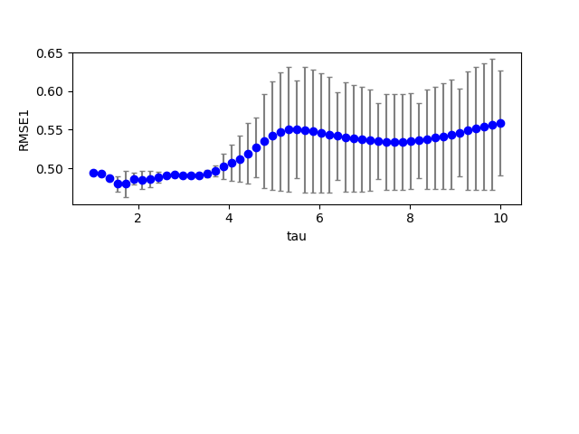

## esn1 (data20190710_esn1)  
### Grid search (scan1ds) 
1D grid search on *** tau (min=1.000000 max=10.000000 num=51 samples=2) ***  
Base configuration: `python esn1.py display=0 dataset=1 `  
Data:**data20190710_esn1_scan1ds_tau.csv**  
Start:2019/07/10 19:21:09  
Done :2019/07/10 19:21:39  
## esn1 (data20190710_esn1)  
### Grid search (scan1ds) 
1D grid search on *** tau (min=1.000000 max=10.000000 num=11 samples=2) ***  
Base configuration: `python esn1.py display=0 dataset=1 `  
Data:**data20190710_esn1_scan1ds_tau.csv**  
Start:2019/07/10 21:01:02  
Done :2019/07/10 21:01:08  
## esn1 (data20190710_esn1)  
### Grid search (scan1ds) 
1D grid search on *** tau (min=1.000000 max=10.000000 num=11 samples=2) ***  
Base configuration: `python esn1.py display=0 dataset=1 `  
Data:**data20190710_esn1_scan1ds_tau.csv**  
Start:2019/07/10 21:02:21  
Done :2019/07/10 21:02:28  
Figure:** data20190710_esn1_scan1ds_tau.png **  
  
## esn1 (data20190710_esn1)  
### Grid search (scan1ds) 
1D grid search on *** tau (min=1.000000 max=10.000000 num=11 samples=2) ***  
Base configuration: `python esn1.py display=0 dataset=4 `  
Data:**data20190710_esn1_scan1ds_tau.csv**  
Start:2019/07/10 21:07:30  
