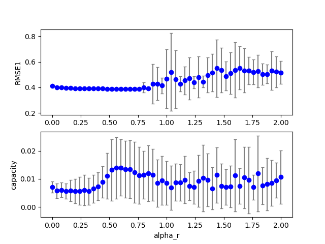
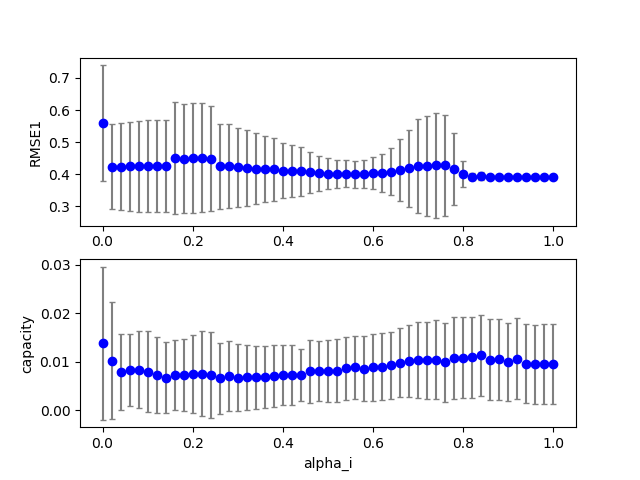
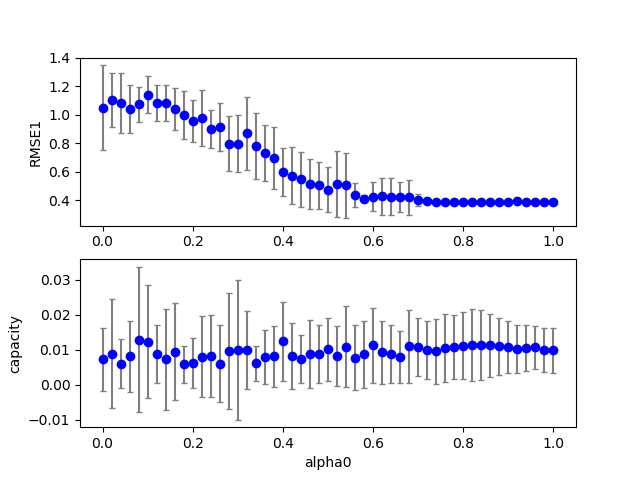
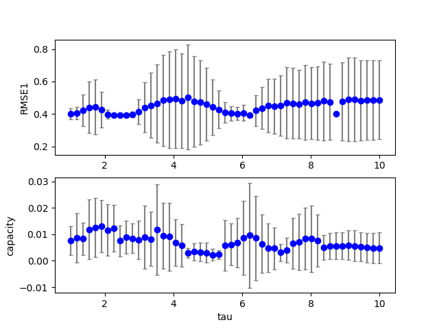

## esn2 (data20190710b_esn2)  
### Grid search (scan1ds) 
1D grid search on *** alpha_r (min=0.000000 max=2.000000 num=51 samples=20) ***  
Base configuration: `python esn2.py display=0 dataset=4 `  
Data:**data20190710b_esn2_scan1ds_alpha_r.csv**  
Start:2019/07/10 23:34:21  
## esn2 (data20190710b_esn2)  
### Grid search (scan1ds) 
1D grid search on *** alpha_r (min=0.000000 max=2.000000 num=51 samples=20) ***  
Base configuration: `python esn2.py display=0 dataset=4 `  
Data:**data20190710b_esn2_scan1ds_alpha_r.csv**  
Start:2019/07/10 23:40:32  
Done :2019/07/10 23:42:08  
Figure:** data20190710b_esn2_scan1ds_alpha_r.png **  
  
### Grid search (scan1ds) 
1D grid search on *** alpha_i (min=0.000000 max=1.000000 num=51 samples=20) ***  
Base configuration: `python esn2.py display=0 dataset=4 `  
Data:**data20190710b_esn2_scan1ds_alpha_i.csv**  
Start:2019/07/10 23:42:08  
Done :2019/07/10 23:43:47  
Figure:** data20190710b_esn2_scan1ds_alpha_i.png **  
  
### Grid search (scan1ds) 
1D grid search on *** alpha0 (min=0.000000 max=1.000000 num=51 samples=20) ***  
Base configuration: `python esn2.py display=0 dataset=4 `  
Data:**data20190710b_esn2_scan1ds_alpha0.csv**  
Start:2019/07/10 23:43:48  
Done :2019/07/10 23:45:23  
Figure:** data20190710b_esn2_scan1ds_alpha0.png **  
  
### Grid search (scan1ds) 
1D grid search on *** tau (min=1.000000 max=10.000000 num=51 samples=10) ***  
Base configuration: `python esn2.py display=0 dataset=4 `  
Data:**data20190710b_esn2_scan1ds_tau.csv**  
Start:2019/07/10 23:45:23  
Done :2019/07/10 23:46:10  
Figure:** data20190710b_esn2_scan1ds_tau.png **  
  
