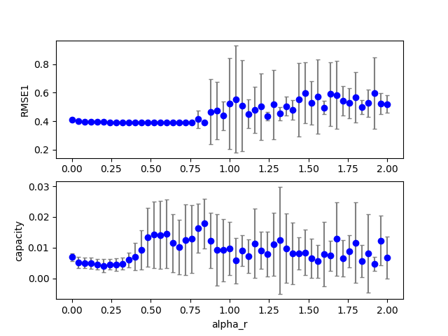

## esn2 (data20190710c_esn2)  
### Grid search (scan1ds) 
1D grid search on *** alpha_r (min=0.000000 max=2.000000 num=51 samples=10) ***  
Base configuration: `python esn2.py display=0 dataset=4 alpha_r = 0.6 alpha_i = 0.8 alpha0 = 0.7 tau = 2 `  
Data:**data20190710c_esn2_scan1ds_alpha_r.csv**  
Start:2019/07/10 23:52:21  
Done :2019/07/10 23:53:11  
Figure:** data20190710c_esn2_scan1ds_alpha_r.png **  
  
### Grid search (scan1ds) 
1D grid search on *** alpha_i (min=0.000000 max=1.000000 num=51 samples=10) ***  
Base configuration: `python esn2.py display=0 dataset=4 alpha_r = 0.6 alpha_i = 0.8 alpha0 = 0.7 tau = 2 `  
Data:**data20190710c_esn2_scan1ds_alpha_i.csv**  
Start:2019/07/10 23:53:11  
