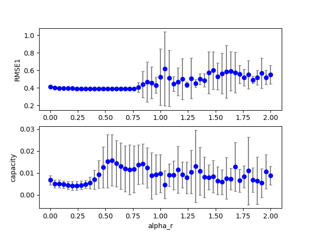
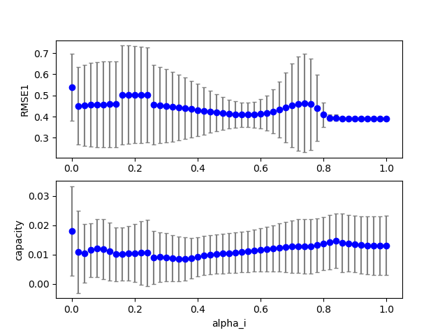
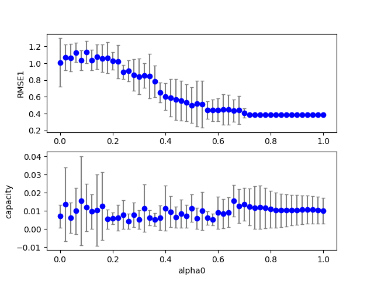
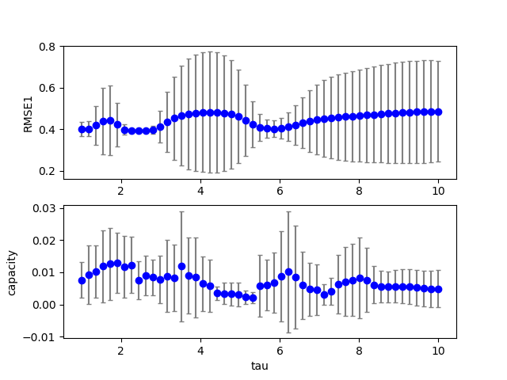

## esn2 (data20190711_esn2)  
### Grid search (scan1ds) 
1D grid search on *** alpha_r (min=0.000000 max=2.000000 num=51 samples=10) ***  
Base configuration: `python esn2.py display=0 dataset=4 alpha_r = 0.6 alpha_i = 0.8 alpha0 = 0.7 tau = 2 `  
Data:**data20190711_esn2_scan1ds_alpha_r.csv**  
Start:2019/07/11 16:24:19  
Done :2019/07/11 16:25:49  
Figure:** data20190711_esn2_scan1ds_alpha_r.png **  
  
### Grid search (scan1ds) 
1D grid search on *** alpha_i (min=0.000000 max=1.000000 num=51 samples=10) ***  
Base configuration: `python esn2.py display=0 dataset=4 alpha_r = 0.6 alpha_i = 0.8 alpha0 = 0.7 tau = 2 `  
Data:**data20190711_esn2_scan1ds_alpha_i.csv**  
Start:2019/07/11 16:25:50  
Done :2019/07/11 16:27:20  
Figure:** data20190711_esn2_scan1ds_alpha_i.png **  
  
### Grid search (scan1ds) 
1D grid search on *** alpha0 (min=0.000000 max=1.000000 num=51 samples=10) ***  
Base configuration: `python esn2.py display=0 dataset=4 alpha_r = 0.6 alpha_i = 0.8 alpha0 = 0.7 tau = 2 `  
Data:**data20190711_esn2_scan1ds_alpha0.csv**  
Start:2019/07/11 16:27:21  
Done :2019/07/11 16:28:52  
Figure:** data20190711_esn2_scan1ds_alpha0.png **  
  
### Grid search (scan1ds) 
1D grid search on *** tau (min=1.000000 max=10.000000 num=51 samples=10) ***  
Base configuration: `python esn2.py display=0 dataset=4 alpha_r = 0.6 alpha_i = 0.8 alpha0 = 0.7 tau = 2 `  
Data:**data20190711_esn2_scan1ds_tau.csv**  
Start:2019/07/11 16:28:53  
Done :2019/07/11 16:30:23  
Figure:** data20190711_esn2_scan1ds_tau.png **  
  
