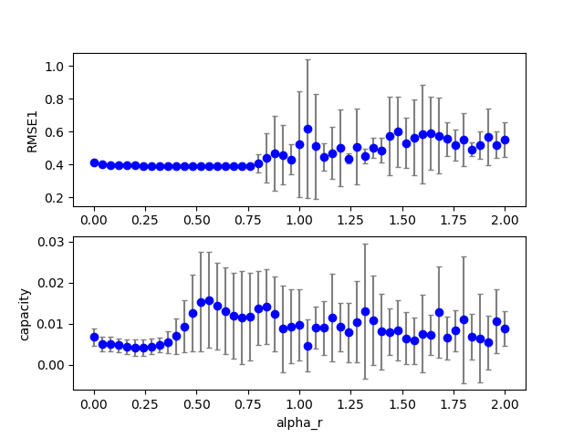
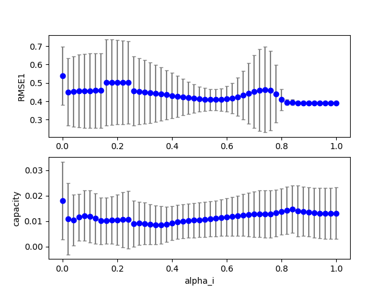
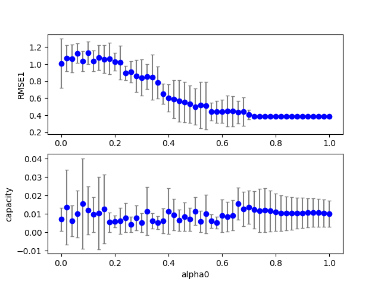
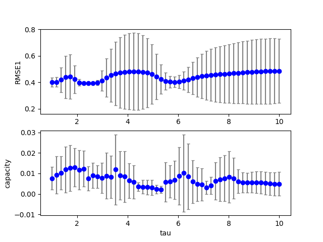

## esn2 (data20190711b_esn2)  
### Optimization 
Configuration:  
```
id      : 0.000000
seed    : 0.000000
alpha_r : 0.800000
alpha_i : 0.800000
alpha0  : 0.700000
tau     : 2.000000
target: RMSE1 
iteration: 10 
population: 20 
samples: 10 
```
Start:2019/07/11 16:43:40  
Done :2019/07/11 16:48:20  
Result:  
```
dataset : 4.000000
seed    : 4.500000
Nx      :100.000000
alpha_i : 1.600000
alpha_r : 0.060000
alpha_b : 0.000000
alpha0  : 0.210000
tau     : 3.870000
beta_i  : 0.100000
beta_r  : 0.100000
beta_b  : 0.100000
lambda0 : 0.100000
RMSE1   : 0.387010
RMSE2   : 0.000000
capacity: 0.007400
TARGET  : 0.387010
```
best:  
```
python esn2.py display=0 dataset=4  alpha_r=0.06000000 alpha_i=1.60000000 alpha0=0.21000000 tau=3.87000000 
```
### Grid search (scan1ds) 
1D grid search on *** alpha_r (min=0.000000 max=2.000000 num=51 samples=10) ***  
Base configuration: `python esn2.py display=0 dataset=4 `  
Data:**data20190711b_esn2_scan1ds_alpha_r.csv**  
Start:2019/07/11 16:48:20  
Done :2019/07/11 16:49:29  
Figure:** data20190711b_esn2_scan1ds_alpha_r.png **  
  
### Grid search (scan1ds) 
1D grid search on *** alpha_i (min=0.000000 max=1.000000 num=51 samples=10) ***  
Base configuration: `python esn2.py display=0 dataset=4 `  
Data:**data20190711b_esn2_scan1ds_alpha_i.csv**  
Start:2019/07/11 16:49:29  
Done :2019/07/11 16:50:39  
Figure:** data20190711b_esn2_scan1ds_alpha_i.png **  
  
### Grid search (scan1ds) 
1D grid search on *** alpha0 (min=0.000000 max=1.000000 num=51 samples=10) ***  
Base configuration: `python esn2.py display=0 dataset=4 `  
Data:**data20190711b_esn2_scan1ds_alpha0.csv**  
Start:2019/07/11 16:50:40  
Done :2019/07/11 16:51:48  
Figure:** data20190711b_esn2_scan1ds_alpha0.png **  
  
### Grid search (scan1ds) 
1D grid search on *** tau (min=1.000000 max=10.000000 num=51 samples=10) ***  
Base configuration: `python esn2.py display=0 dataset=4 `  
Data:**data20190711b_esn2_scan1ds_tau.csv**  
Start:2019/07/11 16:51:48  
Done :2019/07/11 16:52:57  
Figure:** data20190711b_esn2_scan1ds_tau.png **  
  
