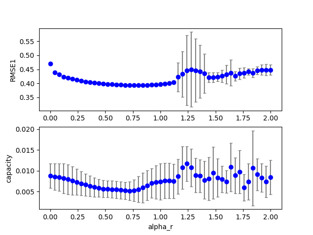
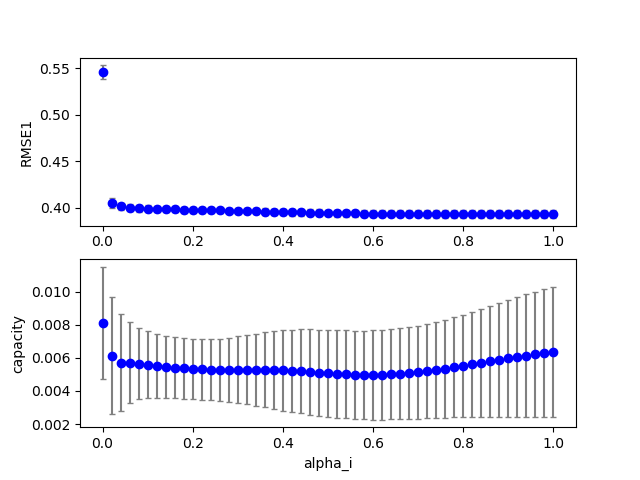

## esn2 (data20190711b_esn3)  
### Optimization 
Configuration:  
```
id      : 0.000000
seed    : 0.000000
alpha_r : 0.800000
alpha_i : 0.800000
target: RMSE1 
iteration: 10 
population: 20 
samples: 10 
```
Start:2019/07/11 20:16:35  
Done :2019/07/11 20:21:09  
Result:  
```
dataset : 4.000000
seed    : 4.500000
Nx      :100.000000
alpha_i : 0.760000
alpha_r : 0.820000
alpha_b : 0.000000
alpha0  : 0.700000
tau     : 2.000000
beta_i  : 0.100000
beta_r  : 0.100000
beta_b  : 0.100000
lambda0 : 0.100000
RMSE1   : 0.393147
RMSE2   : 0.000000
capacity: 0.005522
TARGET  : 0.393147
```
best:  
```
python esn3.py display=0 dataset=4  alpha_r=0.82000000 alpha_i=0.76000000 
```
### Grid search (scan1ds) 
1D grid search on *** alpha_r (min=0.000000 max=2.000000 num=51 samples=10) ***  
Base configuration: `python esn3.py display=0 dataset=4 `  
Data:**data20190711b_esn3_scan1ds_alpha_r.csv**  
Start:2019/07/11 20:21:09  
Done :2019/07/11 20:22:16  
Figure:** data20190711b_esn3_scan1ds_alpha_r.png **  
  
### Grid search (scan1ds) 
1D grid search on *** alpha_i (min=0.000000 max=1.000000 num=51 samples=10) ***  
Base configuration: `python esn3.py display=0 dataset=4 `  
Data:**data20190711b_esn3_scan1ds_alpha_i.csv**  
Start:2019/07/11 20:22:17  
Done :2019/07/11 20:23:23  
Figure:** data20190711b_esn3_scan1ds_alpha_i.png **  
  
