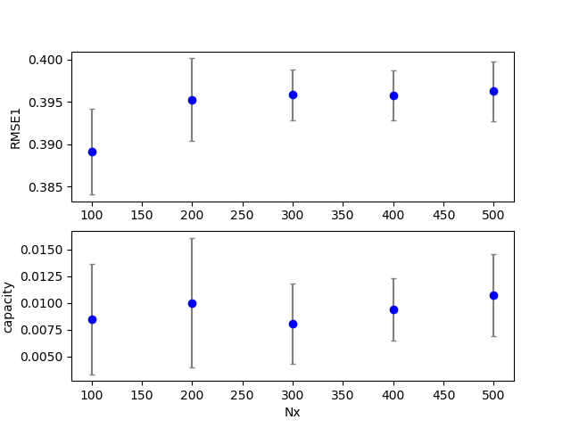
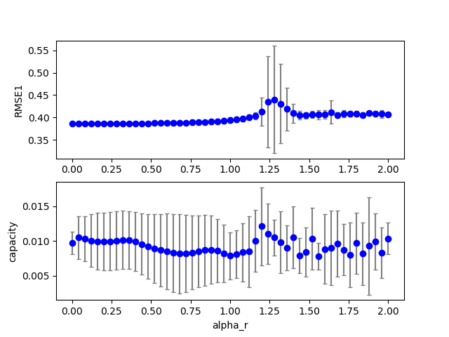
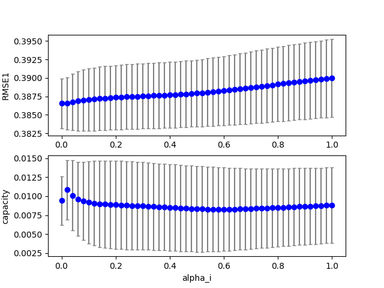

## esn2 (data20190711c_esn3)  

方法：バイアス項を追加した。

### Execute1
Figure:** data20190711c_esn3_exe1.png **  
  
## esn2 (data20190711c_esn3)  
### Grid search (scan1ds)
1D grid search on *** Nx (min=100.000000 max=500.000000 num=5 samples=10) ***  
Base configuration: `python esn3.py display=0 dataset=4 `  
Data:**data20190711c_esn3_scan1ds_Nx.csv**  
Start:2019/07/11 20:56:09  
Done :2019/07/11 20:56:24  
Figure:** data20190711c_esn3_scan1ds_Nx.png **  
  
### Grid search (scan1ds)
1D grid search on *** alpha_r (min=0.000000 max=2.000000 num=51 samples=10) ***  
Base configuration: `python esn3.py display=0 dataset=4 `  
Data:**data20190711c_esn3_scan1ds_alpha_r.csv**  
Start:2019/07/11 20:56:25  
Done :2019/07/11 20:57:33  
Figure:** data20190711c_esn3_scan1ds_alpha_r.png **  
  
### Grid search (scan1ds)
1D grid search on *** alpha_i (min=0.000000 max=1.000000 num=51 samples=10) ***  
Base configuration: `python esn3.py display=0 dataset=4 `  
Data:**data20190711c_esn3_scan1ds_alpha_i.csv**  
Start:2019/07/11 20:57:33  
Done :2019/07/11 20:58:42  
Figure:** data20190711c_esn3_scan1ds_alpha_i.png **  
  
