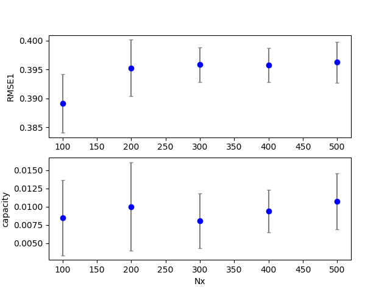
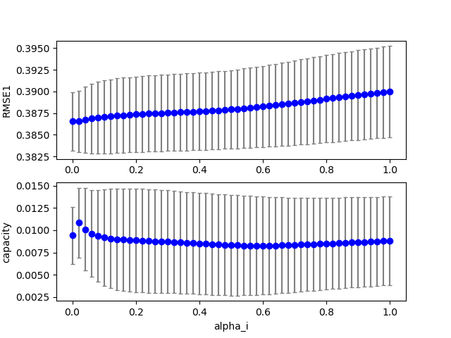

## esn2 (data20190711d_esn3)  
### Optimization 
Configuration:  
```
id      : 0.000000
seed    : 0.000000
alpha_r : 0.800000
alpha_i : 0.800000
target: RMSE1 
iteration: 10 
population: 20 
samples: 10 
```
Start:2019/07/11 21:08:26  
Done :2019/07/11 21:13:07  
Result:  
```
dataset : 4.000000
seed    : 4.500000
Nx      :100.000000
alpha_i : 0.000000
alpha_r : 0.970000
alpha_b : 0.000000
alpha0  : 0.700000
tau     : 2.000000
beta_i  : 0.100000
beta_r  : 0.100000
beta_b  : 0.100000
lambda0 : 0.100000
RMSE1   : 0.386453
RMSE2   : 0.000000
capacity: 0.008098
TARGET  : 0.386453
```
best:  
```
python esn3.py display=0 dataset=4  alpha_r=0.97000000 alpha_i=0.00000000 
```
### Grid search (scan1ds) 
1D grid search on *** Nx (min=100.000000 max=500.000000 num=5 samples=10) ***  
Base configuration: `python esn3.py display=0 dataset=4 `  
Data:**data20190711d_esn3_scan1ds_Nx.csv**  
Start:2019/07/11 21:13:07  
Done :2019/07/11 21:13:21  
Figure:** data20190711d_esn3_scan1ds_Nx.png **  
  
### Grid search (scan1ds) 
1D grid search on *** alpha_r (min=0.000000 max=2.000000 num=51 samples=10) ***  
Base configuration: `python esn3.py display=0 dataset=4 `  
Data:**data20190711d_esn3_scan1ds_alpha_r.csv**  
Start:2019/07/11 21:13:22  
Done :2019/07/11 21:14:30  
Figure:** data20190711d_esn3_scan1ds_alpha_r.png **  
  
### Grid search (scan1ds) 
1D grid search on *** alpha_i (min=0.000000 max=1.000000 num=51 samples=10) ***  
Base configuration: `python esn3.py display=0 dataset=4 `  
Data:**data20190711d_esn3_scan1ds_alpha_i.csv**  
Start:2019/07/11 21:14:31  
Done :2019/07/11 21:15:39  
Figure:** data20190711d_esn3_scan1ds_alpha_i.png **  
  
