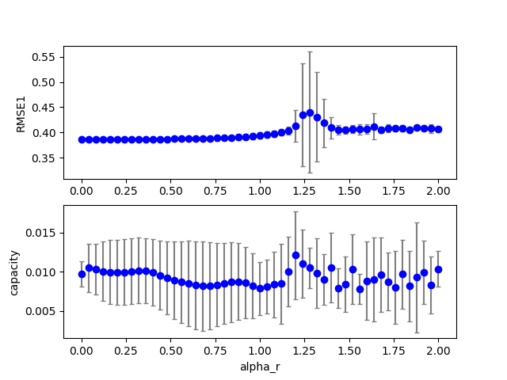
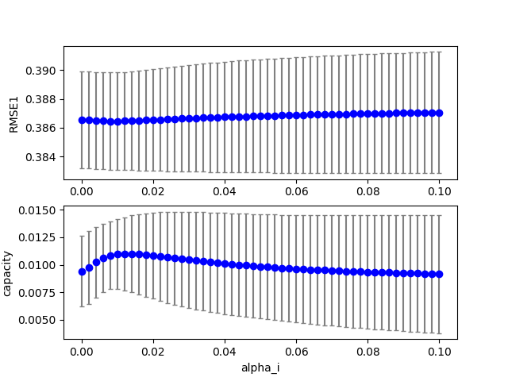
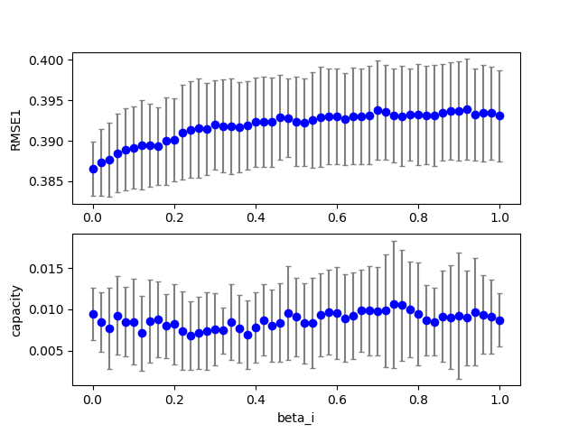
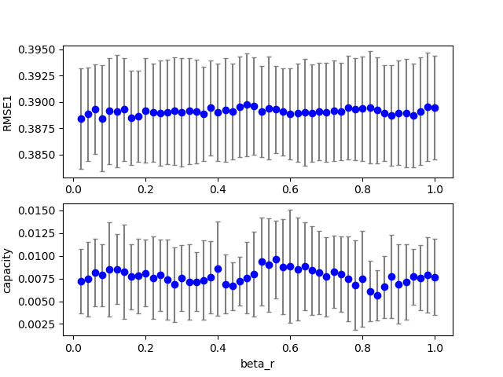

## esn2 (data20190711e_esn3)  
### Grid search (scan1ds) 
1D grid search on *** Nx (min=100.000000 max=500.000000 num=5 samples=10) ***  
Base configuration: `python esn3.py display=0 dataset=4 `  
Data:**data20190711e_esn3_scan1ds_Nx.csv**  
Start:2019/07/11 21:18:38  
Done :2019/07/11 21:18:53  
Figure:** data20190711e_esn3_scan1ds_Nx.png **  
  
### Grid search (scan1ds) 
1D grid search on *** alpha_r (min=0.000000 max=2.000000 num=51 samples=10) ***  
Base configuration: `python esn3.py display=0 dataset=4 `  
Data:**data20190711e_esn3_scan1ds_alpha_r.csv**  
Start:2019/07/11 21:18:54  
Done :2019/07/11 21:20:02  
Figure:** data20190711e_esn3_scan1ds_alpha_r.png **  
  
### Grid search (scan1ds) 
1D grid search on *** alpha_i (min=0.000000 max=0.100000 num=51 samples=10) ***  
Base configuration: `python esn3.py display=0 dataset=4 `  
Data:**data20190711e_esn3_scan1ds_alpha_i.csv**  
Start:2019/07/11 21:20:02  
Done :2019/07/11 21:21:10  
Figure:** data20190711e_esn3_scan1ds_alpha_i.png **  
  
### Grid search (scan1ds) 
1D grid search on *** beta_i (min=0.000000 max=1.000000 num=51 samples=10) ***  
Base configuration: `python esn3.py display=0 dataset=4 `  
Data:**data20190711e_esn3_scan1ds_beta_i.csv**  
Start:2019/07/11 21:21:11  
Done :2019/07/11 21:22:20  
Figure:** data20190711e_esn3_scan1ds_beta_i.png **  
  
### Grid search (scan1ds) 
1D grid search on *** beta_r (min=0.000000 max=1.000000 num=51 samples=10) ***  
Base configuration: `python esn3.py display=0 dataset=4 `  
Data:**data20190711e_esn3_scan1ds_beta_r.csv**  
Start:2019/07/11 21:22:21  
Done :2019/07/11 21:23:29  
Figure:** data20190711e_esn3_scan1ds_beta_r.png **  
  
## esn2 (data20190711e_esn3)  
### Grid search (scan1ds) 
1D grid search on *** Nx (min=100.000000 max=500.000000 num=5 samples=10) ***  
Base configuration: `python esn3.py display=0 dataset=4 `  
Data:**data20190711e_esn3_scan1ds_Nx.csv**  
Start:2019/07/11 22:25:03  
