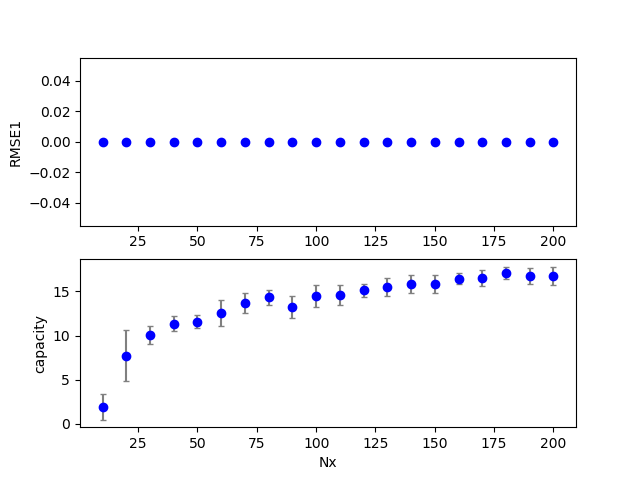
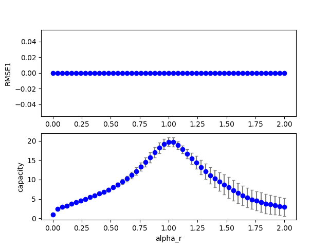
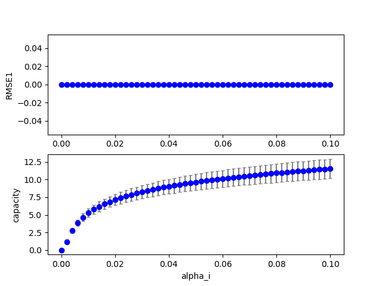
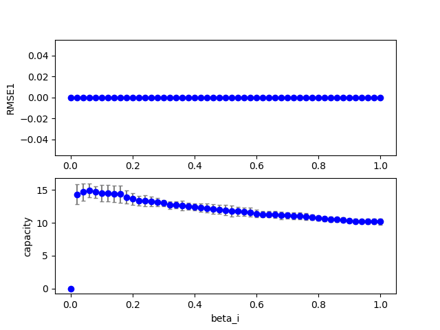
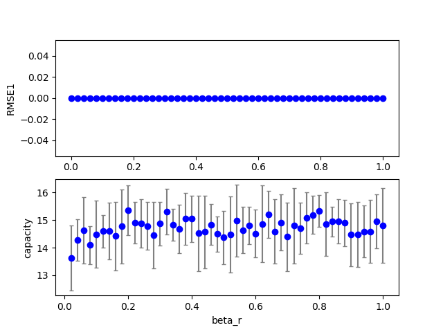

## esn2 (data20190712a_esn3)  
### Grid search (scan1ds) 
1D grid search on *** Nx (min=10.000000 max=200.000000 num=20 samples=10) ***  
Base configuration: `python esn3.py display=0 dataset=4 `  
Data:**data20190712a_esn3_scan1ds_Nx.csv**  
Start:2019/07/12 00:57:47  
Done :2019/07/12 01:06:43  
Figure:** data20190712a_esn3_scan1ds_Nx.png **  
  
### Grid search (scan1ds) 
1D grid search on *** alpha_r (min=0.000000 max=2.000000 num=51 samples=10) ***  
Base configuration: `python esn3.py display=0 dataset=4 `  
Data:**data20190712a_esn3_scan1ds_alpha_r.csv**  
Start:2019/07/12 01:06:45  
Done :2019/07/12 01:22:02  
Figure:** data20190712a_esn3_scan1ds_alpha_r.png **  
  
### Grid search (scan1ds) 
1D grid search on *** alpha_i (min=0.000000 max=0.100000 num=51 samples=10) ***  
Base configuration: `python esn3.py display=0 dataset=4 `  
Data:**data20190712a_esn3_scan1ds_alpha_i.csv**  
Start:2019/07/12 01:22:03  
Done :2019/07/12 01:37:14  
Figure:** data20190712a_esn3_scan1ds_alpha_i.png **  
  
### Grid search (scan1ds) 
1D grid search on *** beta_i (min=0.000000 max=1.000000 num=51 samples=10) ***  
Base configuration: `python esn3.py display=0 dataset=4 `  
Data:**data20190712a_esn3_scan1ds_beta_i.csv**  
Start:2019/07/12 01:37:15  
Done :2019/07/12 01:52:26  
Figure:** data20190712a_esn3_scan1ds_beta_i.png **  
  
### Grid search (scan1ds) 
1D grid search on *** beta_r (min=0.000000 max=1.000000 num=51 samples=10) ***  
Base configuration: `python esn3.py display=0 dataset=4 `  
Data:**data20190712a_esn3_scan1ds_beta_r.csv**  
Start:2019/07/12 01:52:28  
Done :2019/07/12 02:07:42  
Figure:** data20190712a_esn3_scan1ds_beta_r.png **  
  
