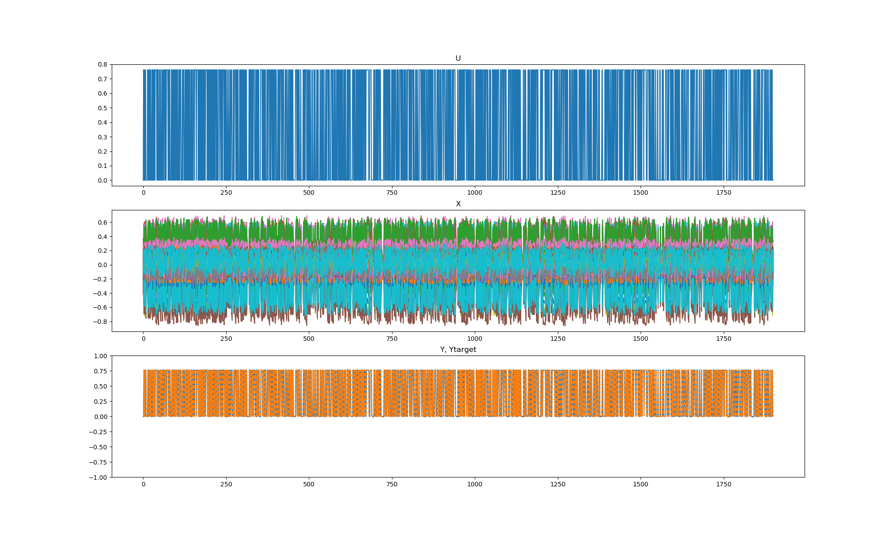
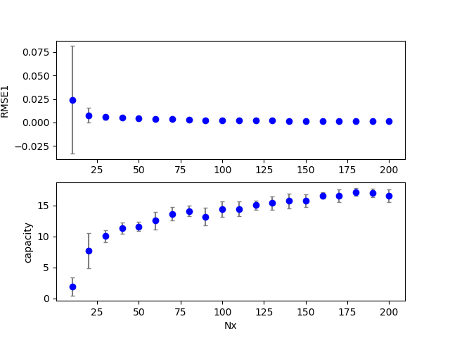
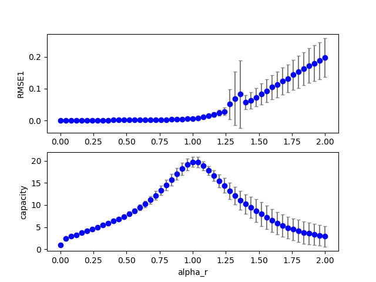
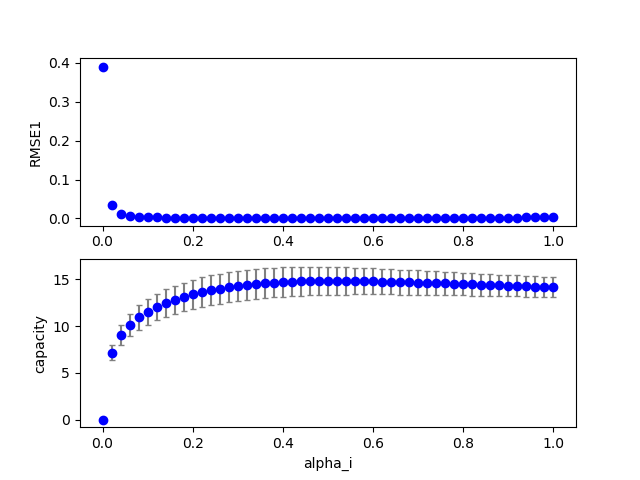
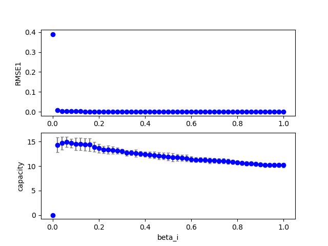
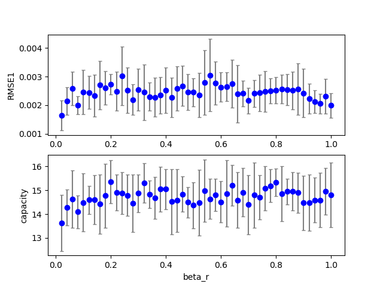

# data20190712b_esn3  

方法：capacity を使ってESNの性能を評価した。
結果：RMSEとは異なる依存性が見られた。

### Execute1
Figure:** data20190712b_esn3_exe1.png **  
  
Configuration:  
```
dataset: 4.0
seed: -1.0
id: 0.0
Nx: 100.0
alpha_i: 0.8
alpha_r: 0.8
alpha_b: 0.0
alpha0: 0.7
tau: 2.0
beta_i: 0.1
beta_r: 0.1
beta_b: 0.1
lambda0: 0.1
RMSE1: 0.0022199999999999998
RMSE2: 0.0
capacity: 13.684458
```
### Grid search (scan1ds)
1D grid search on *** Nx (min=10.000000 max=200.000000 num=20 samples=10) ***  
Base configuration: `python esn3.py display=0 dataset=4 `  
Data:**data20190712b_esn3_scan1ds_Nx.csv**  
Start:2019/07/12 07:11:08  
# data20190712b_esn3  
### Execute1
Figure:** data20190712b_esn3_exe1.png **  
  
Configuration:  
```
dataset: 4.0
seed: -1.0
id: 0.0
Nx: 100.0
alpha_i: 0.8
alpha_r: 0.8
alpha_b: 0.0
alpha0: 0.7
tau: 2.0
beta_i: 0.1
beta_r: 0.1
beta_b: 0.1
lambda0: 0.1
RMSE1: 0.0022199999999999998
RMSE2: 0.0
capacity: 13.684458
```
### Grid search (scan1ds)
1D grid search on *** Nx (min=10.000000 max=200.000000 num=20 samples=10) ***  
Base configuration: `python esn3.py display=0 dataset=4 `  
Data:**data20190712b_esn3_scan1ds_Nx.csv**  
Start:2019/07/12 07:12:37  
Done :2019/07/12 07:22:07  
Figure:** data20190712b_esn3_scan1ds_Nx.png **  
  
### Grid search (scan1ds)
1D grid search on *** alpha_r (min=0.000000 max=2.000000 num=51 samples=10) ***  
Base configuration: `python esn3.py display=0 dataset=4 `  
Data:**data20190712b_esn3_scan1ds_alpha_r.csv**  
Start:2019/07/12 07:22:08  
Done :2019/07/12 07:38:08  
Figure:** data20190712b_esn3_scan1ds_alpha_r.png **  
  
### Grid search (scan1ds)
1D grid search on *** alpha_i (min=0.000000 max=1.000000 num=51 samples=10) ***  
Base configuration: `python esn3.py display=0 dataset=4 `  
Data:**data20190712b_esn3_scan1ds_alpha_i.csv**  
Start:2019/07/12 07:38:11  
Done :2019/07/12 07:54:04  
Figure:** data20190712b_esn3_scan1ds_alpha_i.png **  
  
### Grid search (scan1ds)
1D grid search on *** beta_i (min=0.000000 max=1.000000 num=51 samples=10) ***  
Base configuration: `python esn3.py display=0 dataset=4 `  
Data:**data20190712b_esn3_scan1ds_beta_i.csv**  
Start:2019/07/12 07:54:05  
Done :2019/07/12 08:09:52  
Figure:** data20190712b_esn3_scan1ds_beta_i.png **  
  
### Grid search (scan1ds)
1D grid search on *** beta_r (min=0.000000 max=1.000000 num=51 samples=10) ***  
Base configuration: `python esn3.py display=0 dataset=4 `  
Data:**data20190712b_esn3_scan1ds_beta_r.csv**  
Start:2019/07/12 08:09:53  
Done :2019/07/12 08:25:25  
Figure:** data20190712b_esn3_scan1ds_beta_r.png **  
  
